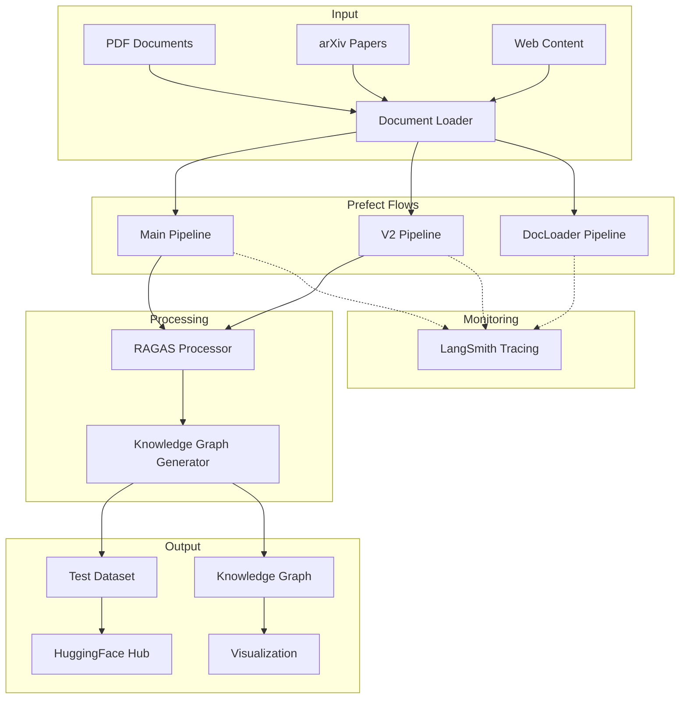
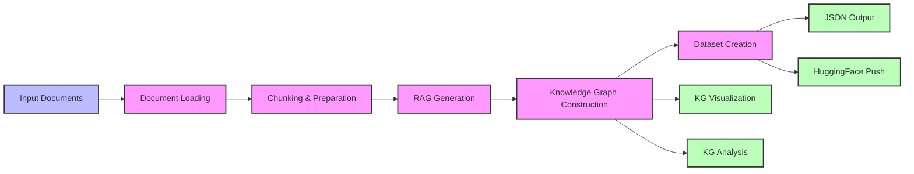
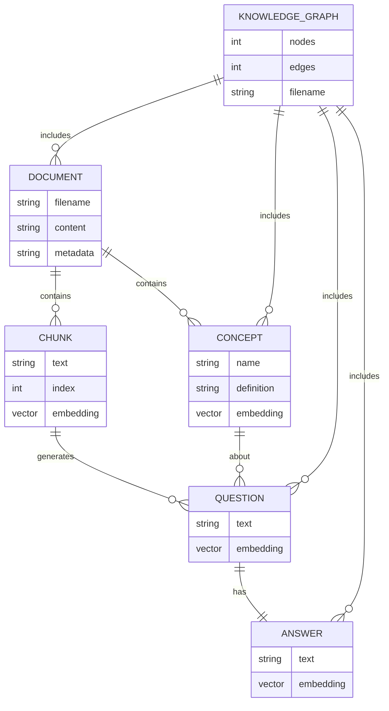

# RAGAS Golden Dataset Pipeline

A comprehensive toolkit for generating high-quality Retrieval-Augmented Generation (RAG) evaluation datasets using Prefect v3 workflows. This pipeline automates the creation of test datasets with the RAGAS framework, producing valuable resources for benchmarking and evaluating RAG systems.

## Table of Contents

- [RAGAS Golden Dataset Pipeline](#ragas-golden-dataset-pipeline)
  - [Table of Contents](#table-of-contents)
  - [Quick Start](#quick-start)
  - [Overview](#overview)
    - [Example Datasets](#example-datasets)
  - [Prerequisites](#prerequisites)
  - [Installation](#installation)
  - [Basic Configuration](#basic-configuration)
  - [Directory Structure](#directory-structure)
  - [Basic Usage](#basic-usage)
  - [Pipeline Architecture](#pipeline-architecture)
    - [System Architecture](#system-architecture)
    - [Data Flow](#data-flow)
    - [Component Relationships](#component-relationships)
  - [Documentation](#documentation)
  - [Troubleshooting](#troubleshooting)
    - [Common Issues](#common-issues)
  - [Related Resources](#related-resources)
    - [Generated Datasets](#generated-datasets)

---

## Quick Start

For experienced users who want to get started quickly:

```bash
# Clone, setup and run
git clone https://github.com/your-username/ragas-golden-dataset-pipeline.git
cd ragas-golden-dataset-pipeline
python -m venv .venv && source .venv/bin/activate  # On Windows: .venv\Scripts\activate
uv pip install -r requirements.txt  # Faster installation with uv (or use pip)
cp .env-example .env  # Edit with your OPENAI_API_KEY

# Start Prefect server and run the pipeline
prefect server start  # In a separate terminal
python prefect_pipeline.py
```

The pipeline will download sample PDFs if none exist, generate a 10-sample RAGAS testset, and output to the output/ directory.

---

## Overview

The RAGAS Golden Dataset Pipeline is designed to automate the generation of RAG evaluation datasets using the RAGAS framework. It processes documents from various sources (PDFs, arXiv papers, web content) and creates structured test datasets with knowledge graphs that can be used to evaluate and benchmark RAG systems.

Key features include:

- **Multiple Pipeline Variants**: Choose from three specialized Prefect v3 flows
- **Comprehensive Error Handling**: Robust error detection and recovery mechanisms
- **Concurrent Task Execution**: Parallel processing for improved performance
- **Rich Artifacts**: Detailed outputs for monitoring and debugging
- **Hugging Face Integration**: Push generated datasets to HF Hub
- **LangSmith Tracing**: Monitor LLM interactions

### Example Datasets

The pipeline has been used to generate the following datasets:

- [RAGAS Golden Dataset](https://huggingface.co/datasets/dwb2023/ragas-golden-dataset) - Dataset generated with the main pipeline
- [RAGAS Golden Dataset V2](https://huggingface.co/datasets/dwb2023/ragas-golden-dataset-v2) - Enhanced dataset from the V2 pipeline
- [RAGAS Golden Dataset Documents](https://huggingface.co/datasets/dwb2023/ragas-golden-dataset-documents) - Document collection from the document loader pipeline

---

## Prerequisites

- Python 3.8 or newer
- Prefect v3
- OpenAI API key
- The following Python libraries:
  - ragas (0.2.15+)
  - prefect (3.4.1+)
  - langchain and related packages
  - openai
  - pypdf
  - huggingface_hub
  - Other utilities (see `requirements.txt`)
- A LangSmith account and API key (optional, for tracing)
- A Hugging Face account and [API token](https://huggingface.co/settings/tokens) (if pushing to HF Hub)

---

## Installation

```bash
# Clone the repository
git clone https://github.com/your-username/ragas-golden-dataset-pipeline.git
cd ragas-golden-dataset-pipeline

# Create and activate a virtual environment
python -m venv .venv
# On Windows:
.venv\Scripts\activate
# On macOS/Linux:
source .venv/bin/activate

# Install dependencies using uv (recommended for faster installation)
uv pip install -r requirements.txt
# Or using pip if uv is not installed
# pip install -r requirements.txt

# Create a .env file from the example
cp .env-example .env
# Edit .env with your API keys and configuration
```

---

## Basic Configuration

The essential configuration is done through environment variables in a `.env` file:

```
# Required
OPENAI_API_KEY=sk-xxx...

# Optional but recommended
LLM_MODEL=gpt-4.1-mini
EMBEDDING_MODEL=text-embedding-3-small
TESTSET_SIZE=10
```

For a complete list of configurable options, see [CONFIGURATION.md](./docs/CONFIGURATION.md).

---

## Directory Structure

```
├── data/                       # Input documents directory
├── output/                     # Generated artifacts and results
├── utilities/                  # Helper scripts and analysis tools
├── prefect_pipeline.py         # Main pipeline implementation
├── prefect_pipeline_v2.py      # Enhanced pipeline with extended features
├── prefect_docloader_pipeline.py # Specialized document loader pipeline
├── requirements.txt            # Project dependencies with versions
├── .env-example                # Template for environment configuration
└── docs/                       # Detailed documentation
    ├── CONFIGURATION.md        # Complete configuration options
    ├── PIPELINES.md            # Detailed pipeline information
    ├── VISUALIZATION.md        # Knowledge graph visualization guide
    └── README_KG_UTIL.md       # Instructions for knowledge graph utilities
```

---

## Basic Usage

**Important**: A Prefect server must be running before executing the pipeline:

```bash
# Start the Prefect server in a separate terminal
prefect server start
```

This starts a server at `http://127.0.0.1:4200` with a web UI.

Then, run one of the pipelines with default parameters:

```bash
# Main Pipeline
python prefect_pipeline.py

# V2 Pipeline
python prefect_pipeline_v2.py

# Document Loader Pipeline
python prefect_docloader_pipeline.py
```

For detailed usage instructions, command-line arguments, and advanced features, see [PIPELINES.md](./docs/PIPELINES.md).

---

## Pipeline Architecture

The following diagrams illustrate the architecture and data flow of the RAGAS Golden Dataset Pipeline:

### System Architecture



### Data Flow



### Component Relationships



---

## Documentation

- [CONFIGURATION.md](./docs/CONFIGURATION.md) - Detailed configuration options and environment variables
- [PIPELINES.md](./docs/PIPELINES.md) - Comprehensive guide to the available pipelines, their features, and usage
- [VISUALIZATION.md](./docs/VISUALIZATION.md) - Instructions for visualizing knowledge graphs and analyzing results
- [README_KG_UTIL.md](./utilities/README_KG_UTIL.md) - Guide to utilities for working with knowledge graphs

---

## Troubleshooting

### Common Issues

1. **Prefect Server Connection Issues**:
   - Ensure the Prefect server is running with `prefect server start`
   - Verify connection with `prefect config view`
   - Check that `PREFECT_API_URL` is correctly set

2. **No PDFs in Data Directory**:
   - The pipeline will download sample research papers if no PDFs are present
   - Ensure your internet connection is active

3. **API Key Issues**:
   - Verify your OpenAI API key is valid and has sufficient credits
   - Check that environment variables are correctly set in `.env`

For more troubleshooting tips, see [PIPELINES.md](./docs/PIPELINES.md#troubleshooting).

---

## Related Resources

- [RAGAS Documentation](https://docs.ragas.io/)
- [Prefect Documentation](https://docs.prefect.io/latest/)
- [LangChain Documentation](https://python.langchain.com/docs/)
- [OpenAI API Documentation](https://platform.openai.com/docs/)
- [Hugging Face Hub Documentation](https://huggingface.co/docs/hub/)
- [arXiv API Documentation](https://arxiv.org/help/api/)

### Generated Datasets

- [RAGAS Golden Dataset](https://huggingface.co/datasets/dwb2023/ragas-golden-dataset)
- [RAGAS Golden Dataset V2](https://huggingface.co/datasets/dwb2023/ragas-golden-dataset-v2)
- [RAGAS Golden Dataset Documents](https://huggingface.co/datasets/dwb2023/ragas-golden-dataset-documents)
