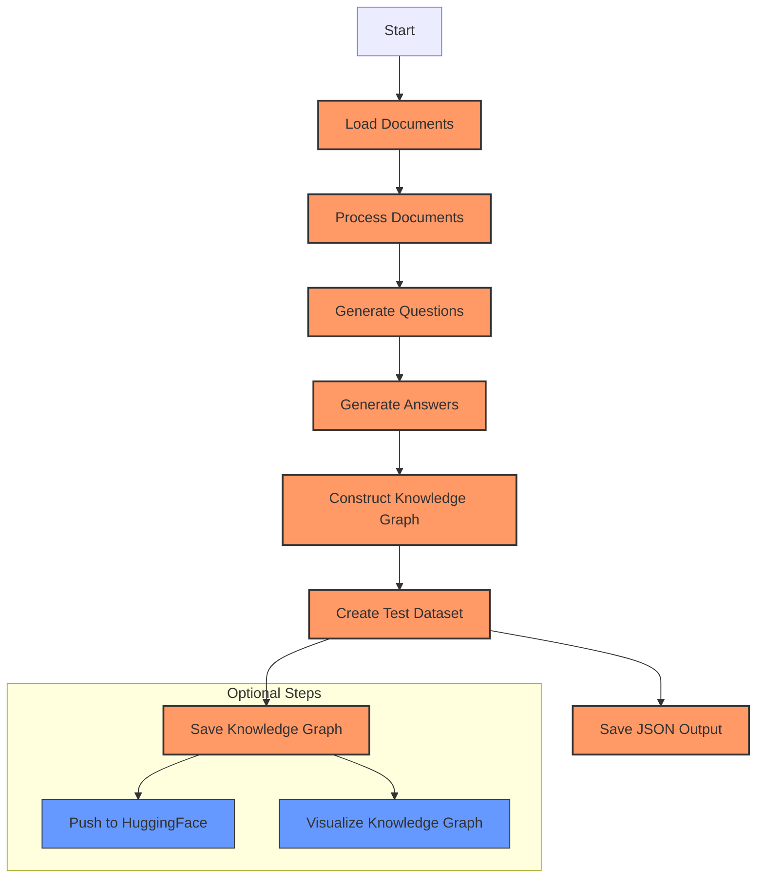
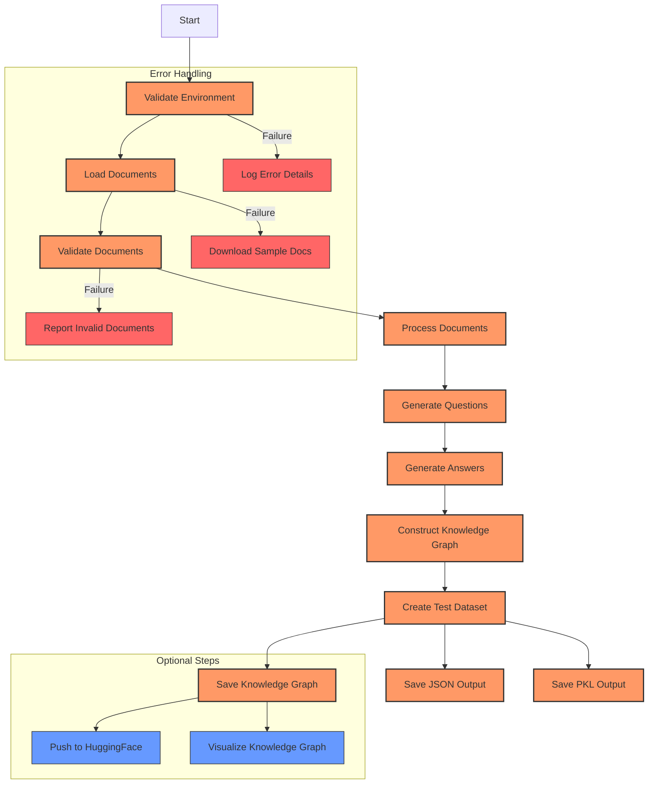
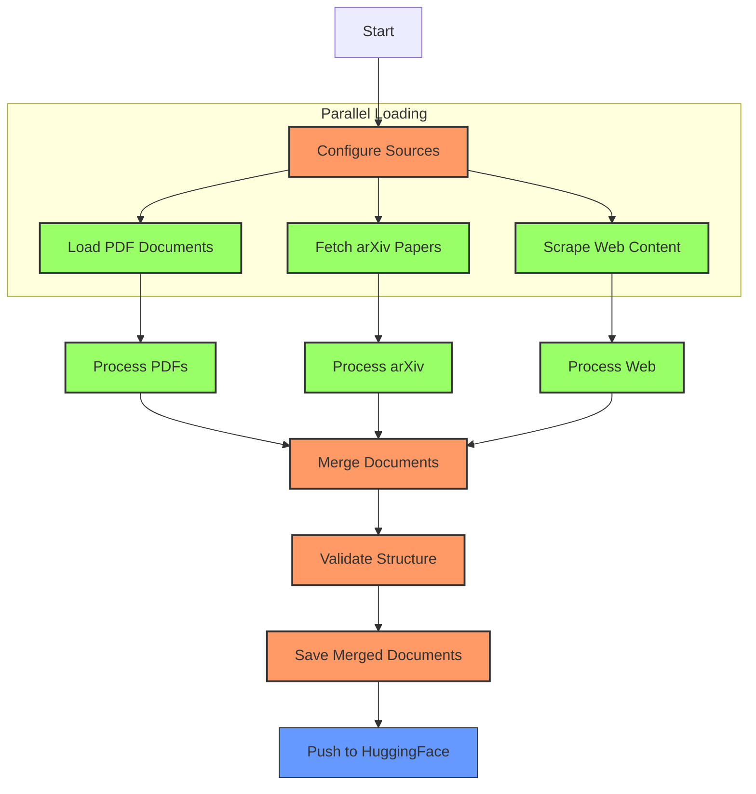
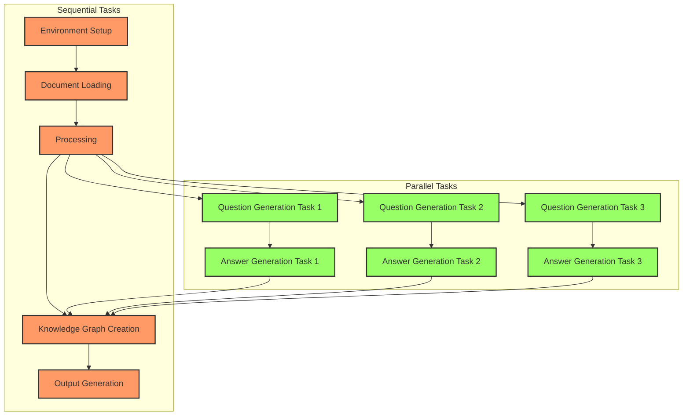

# Prefect Pipelines

This document provides detailed information about the different pipeline options available in the RAGAS Golden Dataset Pipeline.

## Pipeline Overview

The project offers three specialized Prefect v3 flows:

1. **Main Pipeline** (`prefect_pipeline.py`): The standard pipeline for generating RAGAS testsets and knowledge graphs
2. **V2 Pipeline** (`prefect_pipeline_v2.py`): Enhanced version with additional validation, monitoring, and error handling
3. **Document Loader Pipeline** (`prefect_docloader_pipeline.py`): Specialized for loading documents from multiple sources

## Pipeline Workflow Diagrams

### Main Pipeline Flow



### V2 Pipeline Flow



### Document Loader Pipeline Flow



### Task Dependencies and Concurrency



## Main Pipeline

The standard pipeline for generating RAGAS testsets and knowledge graphs.

### Features

- Comprehensive error handling and validation
- Artifact creation for observability
- Concurrent task execution
- Well-documented code with proper type annotations

### Command-line Arguments

```bash
python prefect_pipeline.py \
  --docs-path data/ \
  --testset-size 10 \
  --kg-output output/kg.json \
  --hf-repo your-username/ragas-golden-dataset \
  --llm-model gpt-4.1-mini \
  --embedding-model text-embedding-3-small
```

### Available Arguments

- `--docs-path`: Directory with source documents (default: "data/")
- `--testset-size`: Number of test samples to generate (default: 10)
- `--kg-output`: File path for the knowledge graph (default: "output/kg.json")
- `--hf-repo`: HF Hub repository name (default: from env or empty)
- `--llm-model`: LLM model to use (default: from env or "gpt-4.1-mini")
- `--embedding-model`: Embedding model to use (default: from env or "text-embedding-3-small")

### Expected Output

When running the main pipeline successfully:

```bash
python prefect_pipeline.py
```

You should see output similar to:

```
Flow run 'crimson-sailfish' - Created by deployment 'ragas-pipeline/default'
Flow run 'crimson-sailfish' - ✅ Loading documents from data/ [3 documents found]
Flow run 'crimson-sailfish' - ✅ Generating RAGAS testset with 10 samples
Flow run 'crimson-sailfish' - ✅ Knowledge graph created with 87 nodes and 342 edges
Flow run 'crimson-sailfish' - ✅ Knowledge graph saved to output/kg.json
Flow run 'crimson-sailfish' - Completed successfully
```

## V2 Pipeline

Enhanced version with additional validation, monitoring, and error handling.

### Features

- Improved document saving with multiple format support
- Additional validation mechanisms
- More granular task structure with better retry configuration

This pipeline uses environment variables for configuration rather than command-line arguments.

### Expected Output

The V2 pipeline provides more detailed output with additional validation steps:

```
Flow run 'amber-moose' - Created by deployment 'ragas-pipeline-v2/default'
Flow run 'amber-moose' - ✅ Environment validated successfully
Flow run 'amber-moose' - ✅ Loading documents from data/ [3 documents found]
Flow run 'amber-moose' - ℹ️ Document validation in progress...
Flow run 'amber-moose' - ✅ All documents validated successfully
Flow run 'amber-moose' - ✅ Generating RAGAS testset with 10 samples
Flow run 'amber-moose' - ✅ Knowledge graph created with 92 nodes and 367 edges
Flow run 'amber-moose' - ✅ Documents saved to multiple formats in output/
Flow run 'amber-moose' - ✅ Knowledge graph saved to output/kg.json
Flow run 'amber-moose' - Completed successfully
```

## Document Loader Pipeline

Specialized for loading and comparing documents from multiple sources.

### Features

- Support for PDF files, arXiv papers, and web content
- Structure comparison and standardized output formats
- Metadata extraction and analysis

### Environment Variables

- `DOCS_PATH`: Directory containing PDF files (default: "data/")
- `HF_DOCLOADER_REPO`: HuggingFace repository for pushing the dataset (optional)
- `ARXIV_IDS`: Comma-separated list of arXiv IDs to fetch
- `HTML_URLS`: Comma-separated list of HTML URLs to fetch

## Using Prefect Server

### Starting the Server

```bash
# Start the Prefect server in a separate terminal
prefect server start
```

This starts a server at `http://127.0.0.1:4200` with a web UI.

### Verifying Server Connection

```bash
# Check if the server is running
prefect config view
```

You should see `PREFECT_API_URL` set to `http://127.0.0.1:4200/api` or similar.

> **Note**: Even with `PREFECT_SERVER_ALLOW_EPHEMERAL_MODE=True`, our testing shows that starting a Prefect server is still required.

### Building and Registering Deployments

```bash
# Main pipeline
prefect deployment build prefect_pipeline.py:ragas_pipeline --name ragas-golden
prefect deployment apply ragas-golden-deployment.yaml

# V2 pipeline
prefect deployment build prefect_pipeline_v2.py:ragas_pipeline --name ragas-golden-v2
prefect deployment apply ragas-golden-v2-deployment.yaml

# Document loader pipeline
prefect deployment build prefect_docloader_pipeline.py:docloader_pipeline --name document-loader
prefect deployment apply document-loader-deployment.yaml

# Trigger a run
prefect deployment run ragas-pipeline/ragas-golden
```

## Scheduling

Schedule pipeline runs using Prefect's cron-like scheduling:

```bash
# Schedule daily runs at 06:00 UTC
prefect deployment build prefect_pipeline.py:ragas_pipeline \
  --name daily-ragas \
  --cron "0 6 * * *" \
  --param docs_path=data/ \
  --param testset_size=10
prefect deployment apply daily-ragas-deployment.yaml

# Start a worker to execute scheduled runs
prefect worker start -p default-agent-pool
```

## Troubleshooting

### Common Issues

1. **Prefect Server Connection Issues**:
   - Ensure the Prefect server is running with `prefect server start`
   - Verify connection with `prefect config view`
   - Check that `PREFECT_API_URL` is correctly set

2. **No PDFs in Data Directory**:
   - The pipeline will download sample research papers if no PDFs are present
   - Ensure your internet connection is active

3. **API Key Issues**:
   - Verify your OpenAI API key is valid and has sufficient credits
   - Check that environment variables are correctly set in `.env`

4. **Missing Dependencies**:
   - Run `uv pip install -r requirements.txt` (recommended) or `pip install -r requirements.txt` to ensure all dependencies are installed
   - Use a virtual environment to avoid conflicts

5. **HuggingFace Upload Failures**:
   - Verify your HF token has write permissions
   - Check that your repository exists or can be created

### Getting Help

- Check the Prefect [documentation](https://docs.prefect.io/latest/) for Prefect-specific issues
- Visit the RAGAS [GitHub repository](https://github.com/explodinggradients/ragas) for RAGAS-related questions
- Explore utility scripts in the `utilities/` directory for debugging and analysis 