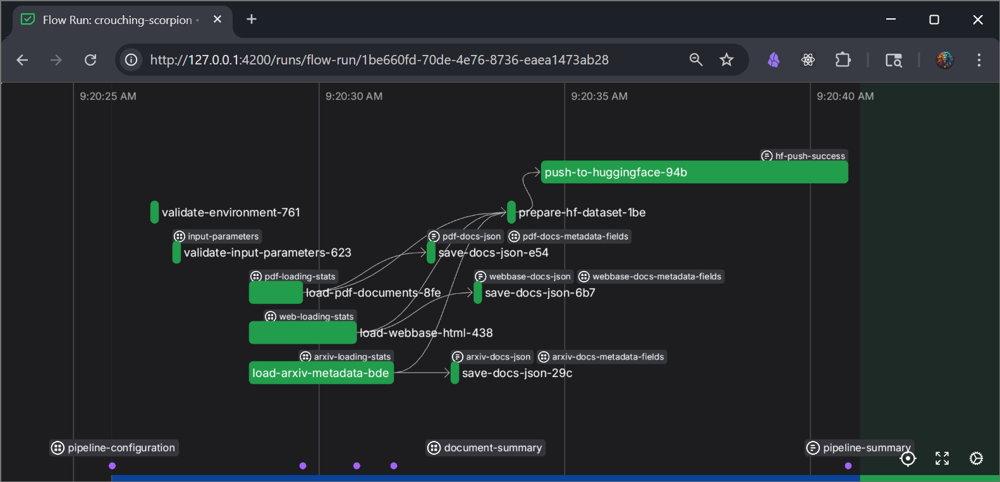
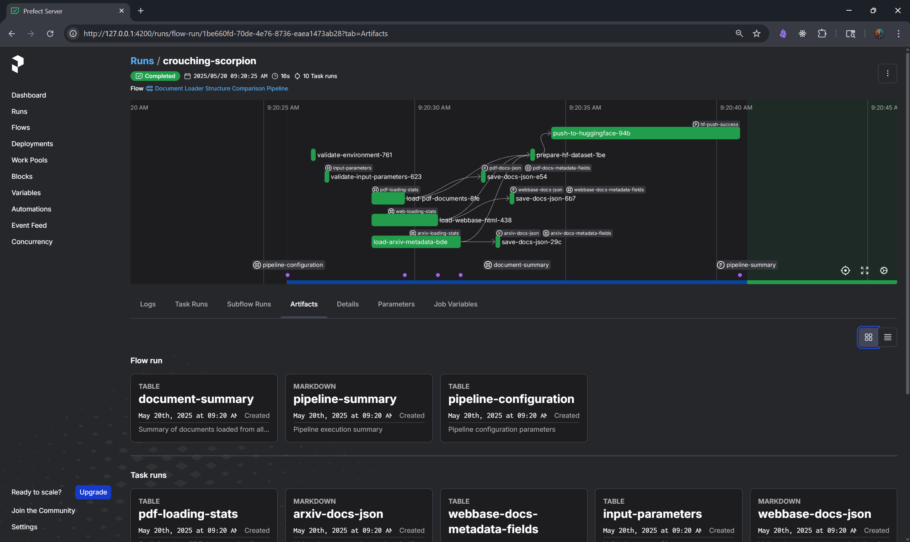

# Document Loader Structure Comparison Pipeline: Getting Started

This guide introduces the LangChain Document Loader Structure Comparison Pipeline, a Prefect workflow that loads documents from PDFs, arXiv papers, and web pages, compares their structures, and publishes them to Hugging Face Hub. It’s ideal for AI engineers and developers analyzing document loader behavior.

## What This Pipeline Does

The pipeline:
1. Loads documents using [LangChain document loaders](https://python.langchain.com/docs/integrations/document_loaders/):
   - PDFs (`PyPDFDirectoryLoader`)
   - arXiv papers (`ArxivLoader`)
   - Web pages (`WebBaseLoader`)
2. Processes content and metadata
3. Saves documents as JSON (`pdf_docs.json`, `arxiv_docs.json`, `webbase_docs.json`)
4. Analyzes structural differences via Prefect UI artifacts
5. Pushes the combined dataset to Hugging Face Hub

It reveals nuances in document loader behavior, useful for document processing or RAG workflows.

## Pipeline Workflow

```
[Start] → [Validate inputs] → [Load: PDFs, arXiv, Web] → [Normalize data] → [Save JSON] → [Analyze (Prefect UI)] → [Push to Hugging Face] → [End]
```

## Key Terms for Beginners

- **Prefect**: A tool to orchestrate and monitor workflows.
- **LangChain**: A Python library for document and language model tasks.
- **Hugging Face Hub**: A platform for sharing datasets (optional for publishing).
- **Virtual Environment**: An isolated Python setup to avoid package conflicts.

## Prerequisites

- Python 3.11+
- Prefect 3.4.1+
- Optional: Hugging Face account and User Access Token (for publishing)
- Packages in `requirements.txt`:
  - `prefect`, `langchain`, `pypdf`, `arxiv`, `pymupdf`, `huggingface_hub`
- [uv](https://docs.astral.sh/uv/) (recommended for faster installation)

**Note**: Requires ~2GB RAM and 1GB disk space for small datasets.

## Setting Up Your Environment

1. Clone the repository:
   ```bash
   git clone https://github.com/donbr/ragas-golden-dataset-pipeline.git
   cd ragas-golden-dataset-pipeline
   ```
2. Create a virtual environment:
   ```bash
   uv venv
   # Windows: .venv\Scripts\activate
   # macOS/Linux: source .venv/bin/activate
   ```
3. Install dependencies:
   ```bash
   uv pip install -r requirements.txt
   ```
4. Create a `.env` file:
   ```bash
   cp .env-example .env
   ```
5. Edit `.env` with:
   ```ini
   # Required for Hugging Face publishing (omit to skip)
   HF_TOKEN=your_hugging_face_token_here
   HF_DOCLOADER_REPO=your-username/document-loader-comparison
   ```

> **Tip:** Get `HF_TOKEN` from [Hugging Face Settings → Access Tokens](https://huggingface.co/docs/hub/security-tokens). If you don’t want to publish to HF, simply set both `HF_TOKEN` and `HF_DOCLOADER_REPO` in the `.env` file to empty.


## Running the Pipeline

1. Start the Prefect server:
   ```bash
   prefect server start
   ```
   Access the Prefect UI at [http://127.0.0.1:4200/](http://127.0.0.1:4200/).
2. Run the pipeline:
   ```bash
   python prefect_docloader_pipeline.py
   ```
3. **View Run Information**: When the pipeline starts, check the console for a flow run URL, e.g.:
   ```
   13:04:14.621 | INFO    | Flow run 'refreshing-ocelot' - View at http://127.0.0.1:4200/runs/flow-run/ae228d0c-02c6-46c5-8255-43935df3b92c
   ```
   Open this URL in your browser to monitor the flow run, view task statuses, logs, and artifacts in the Prefect UI.

   ]

**Expected Runtime**: ~5-10 minutes on a standard laptop (16GB RAM, 4-core CPU).

## Pipeline Outputs

### 1. JSON Files (in `output/`)
- `pdf_docs.json`: PDF documents
- `arxiv_docs.json`: arXiv summaries
- `webbase_docs.json`: Web documents

Each contains content and metadata (e.g., `loader_type`, `load_timestamp`).

### 2. Prefect UI Artifacts
- **pipeline-configuration**: Pipeline configuration parameters (e.g., `DOCS_PATH`, `ARXIV_IDS`).
- **document-summary**: Summary of documents loaded from all sources (e.g., document counts per source).
- **pipeline-summary**: Pipeline execution summary (e.g., total documents, output files, Hugging Face status).




### 3. Hugging Face Dataset
If `HF_TOKEN` and `HF_DOCLOADER_REPO` are set, a combined dataset is pushed to your Hugging Face repository (e.g., `your-username/document-loader-comparison`).

See a [sample dataset](https://huggingface.co/datasets/dwb2023/ragas-golden-dataset-documents) here.

- Check out the saved queries in the [Data Studio](https://huggingface.co/datasets/dwb2023/ragas-golden-dataset-documents/viewer/default/train) for some initial queries to understand the metadata fields.

## Analyzing Document Structures

1. Compare JSON files for content/metadata differences.
2. Check Prefect UI artifacts (e.g., `document-summary` for counts, `pipeline-configuration` for settings) via the flow run URL.
3. If published, query the Hugging Face dataset for loader-specific insights.
4. Identify the best loader for preserving information.

## Customizing the Pipeline

Pseudo code for adding a CSV loader:
```python
from langchain.document_loaders import CSVLoader
@task
def load_csv_docs():
    loader = CSVLoader(file_path="data/csv_files")
    docs = loader.load()
    for doc in docs:
        doc.metadata["loader_type"] = "csv"
        doc.metadata["load_timestamp"] = datetime.datetime.now().isoformat()
    return docs
```

- that's the TLDR version anyway... you'll also need to update `docloader_pipeline` to include `load_csv_docs` and save as `csv_docs.json`.

## Troubleshooting

### Common Issues

| Issue | Solution |
|-------|----------|
| `No PDF files found` | Add PDFs to `data/`. Pipeline returns empty list for PDFs. |
| `Failed to reach API` | Run `prefect server start`. |
| `Missing required environment variables` | Verify HF_TOKEN and HF_DOCLOADER_REPO are set in `.env` |
| `ModuleNotFoundError` | Run `uv pip install -r requirements.txt`. |

### Checking Flow Execution

1. Console for errors (e.g., `ValueError: Invalid URL`).
2. Prefect UI → Task Runs (via the flow run URL) for logs (e.g., `pdf-loading-error`).
3. Artifacts tab for reports (e.g., `input-validation`).

**Tip**: Filter by “Failed” tasks in the flow run’s UI page to debug.

## Versioning and Updates

Uses Prefect 3.4.1 and Python 3.11. Check [repository](https://github.com/your-username/ragas-golden-dataset-pipeline) for updates.

## Next Steps

- Enhance Hugging Face dataset metadata (if published).
- Integrate with RAG workflows.
- Contribute via GitHub issues/pull requests.
- Scale for larger datasets (add RAM, cloud storage).

## Additional Resources

- [uv Documentation](https://docs.astral.sh/uv/)
- [Hugging Face Datasets Quickstart](https://huggingface.co/docs/datasets/en/quickstart)
- [Prefect Documentation](https://docs.prefect.io/)
- [CONFIGURATION.md](./CONFIGURATION.md)
- [PIPELINES.md](./PIPELINES.md)
