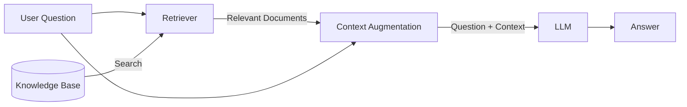
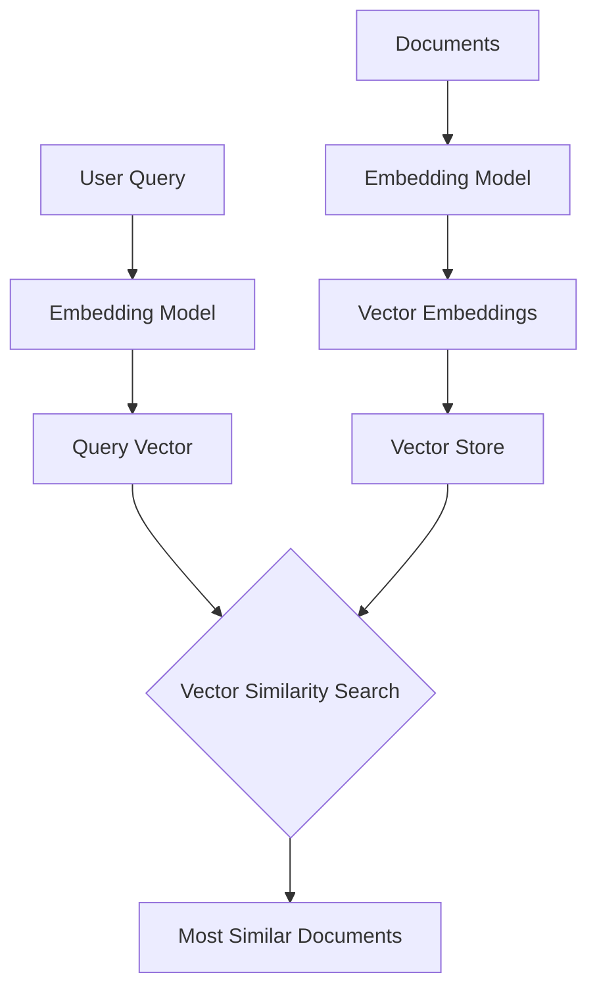
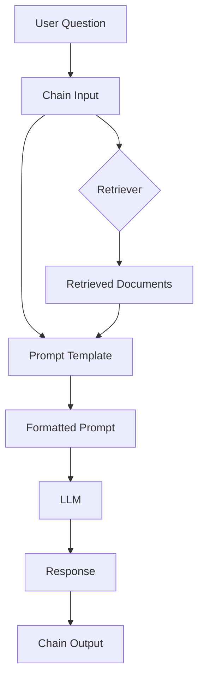

# Core Concepts in the Advanced RAG Retriever API

This document explains the fundamental concepts and technologies used in the Advanced RAG Retriever API project. Understanding these will help you grasp how the application works "under the hood."

> 📚 **Learning Path**: This document is part of a three-part learning progression:
>
> 1. [README.md](./README.md): Practical guide for setup and usage
> 2. **concepts.md (this file)**: Core RAG concepts and component explanations
> 3. [advanced_concepts.md](./advanced_concepts.md): Advanced techniques and optimizations

## 1. Retrieval Augmented Generation (RAG)

**What is it?**
Retrieval Augmented Generation (RAG) is a technique that enhances the capabilities of Large Language Models (LLMs) by connecting them to external knowledge sources. Instead of solely relying on the vast but static information learned during its training, an LLM coupled with RAG can access and utilize specific, up-to-date, or proprietary information to generate more accurate, relevant, and context-aware responses. As of 2025, RAG has evolved to include multimodal capabilities, enabling systems to retrieve and process not just text, but also images, videos, and structured data.

**Simplified Flow:**
1.  **User Question:** The user asks a question.
2.  **Retrieval:** A "Retriever" component searches a specified knowledge base (e.g., a collection of documents, images, or structured data) for information relevant to the question.
3.  **Augmentation:** The retrieved information (context) is combined with the original user question.
4.  **Generation:** This combined input (question + context) is fed to an LLM.
5.  **Answer:** The LLM generates an answer based on both the question and the provided context.



**Why RAG Matters:**

RAG addresses several limitations of pure LLM approaches:

1. **Knowledge Cutoff**: LLMs can only access information they were trained on, while RAG can use up-to-date sources.
2. **Factual Accuracy**: LLMs sometimes "hallucinate" facts, while RAG provides specific source material.
3. **Domain Expertise**: RAG enables LLMs to work with specialized knowledge without retraining.
4. **Transparency**: RAG can cite its sources, making answers more verifiable and trustworthy.

**Example Comparison:**

Let's see how a pure LLM response differs from a RAG-enhanced response:

**Question:** "How did critics rate John Wick 3?"

*Pure LLM:* "John Wick 3 was generally well-received by critics, with praise for its action sequences and Keanu Reeves' performance. It has a high rating on aggregator sites, though the exact numbers would depend on when you're asking."

*RAG-enhanced:* "Critics gave John Wick 3 very positive reviews. Based on the retrieved reviews, it received ratings between 8-10/10 from multiple reviewers who specifically praised the 'beautifully choreographed action sequences,' 'stunning visuals,' and Keanu Reeves' dedicated performance. One reviewer called it 'the best action film of 2019.'"

## 2. Key Components in This Project

This project utilizes several key components, primarily from the LangChain framework, to build the RAG pipeline.

### a. Data Loading (`src/data_loader.py`)

*   **Purpose:** To ingest raw data and prepare it for the RAG pipeline.
*   **In this project:** We load John Wick movie reviews from CSV files. Each review is transformed into a LangChain `Document` object, which includes the text content and associated metadata (like review date, title, author, rating).

**Simplified Code Example:**
```python
# This is a simplified version of what happens in data_loader.py
from langchain_community.document_loaders.csv_loader import CSVLoader

# Load documents from CSV files
loader = CSVLoader(
    file_path="docs/jw1.csv",  # Path to the CSV file
    metadata_columns=["Review_Date", "Review_Title", "Review_Url", "Author", "Rating"]
)

# Load the documents
documents = loader.load()

# Enhance documents with additional metadata
for doc in documents:
    doc.metadata["Movie_Title"] = "John Wick 1"
    doc.metadata["Rating"] = int(doc.metadata["Rating"]) if doc.metadata["Rating"] else 0

# Now these documents can be fed into the RAG pipeline
```

**Why This Matters:** The quality of your source documents directly impacts the quality of retrieved answers. Good document processing should:
- Include relevant metadata that can be used for filtering or ranking
- Handle text normalization for consistent retrieval
- Properly split documents to maintain context while enabling precise retrieval

### b. Embeddings (`src/embeddings.py`)

*   **What they are:** Embeddings are numerical representations (vectors) of text. These vectors capture the semantic meaning of the text, meaning that words, phrases, or documents with similar meanings will have mathematically similar vector representations.
*   **Why they're used:** They are crucial for semantic search. By converting both documents and queries into embeddings, we can find relevant documents by identifying those whose embeddings are "closest" in vector space to the query's embedding.
*   **In this project:** We use OpenAI's `text-embedding-3-small` model to generate these embeddings.

**Simplified Code Example:**
```python
# This is a simplified version of what happens in embeddings.py
from langchain_openai import OpenAIEmbeddings

# Initialize the embedding model
embeddings = OpenAIEmbeddings(
    model="text-embedding-3-small",  # Specify which model to use
)

# Example of converting text to an embedding vector
text = "What did critics think about John Wick's action scenes?"
embedding_vector = embeddings.embed_query(text)

# The embedding_vector is a list of floating point numbers
# e.g., [0.123, -0.456, 0.789, ...] (typically 1536 dimensions for OpenAI embeddings)
```

**Why This Matters:** The quality of embeddings directly affects the accuracy of semantic search. Good embeddings will:
- Place semantically similar texts close together in vector space
- Separate unrelated concepts, even if they share keywords
- Capture nuance and context, not just literal meanings

### c. Vector Stores (`src/vectorstore_setup.py`)

*   **What they are:** Specialized databases designed to efficiently store, manage, and search through large quantities of vector embeddings.
*   **How they work:** When documents are added, their text is converted to embeddings, which are then stored in the vector store. When a query comes in, its embedding is calculated and used to search the vector store for the most similar document embeddings.
*   **In this project:** We use Qdrant as our vector store, configured to run in-memory (`location=":memory:"`). This means the vector stores exist only for the duration of the application's runtime and are not persisted to disk. We initialize a few different collections:
    *   `JohnWickMain`: Stores embeddings of the review documents for general-purpose retrieval.
    *   `full_documents` (used by Parent Document Retriever): Stores embeddings of smaller "child" chunks of documents.
    *   `JohnWickSemantic`: Stores embeddings of document chunks created by the `SemanticChunker`.



**Simplified Code Example:**
```python
# This is a simplified version of what happens in vectorstore_setup.py
from langchain_qdrant import Qdrant
from qdrant_client import QdrantClient

# Initialize a Qdrant client (in-memory for this example)
client = QdrantClient(location=":memory:")

# Create a vector store from documents
vectorstore = Qdrant.from_documents(
    documents=documents,  # The documents loaded earlier
    embedding=embeddings,  # The embedding model initialized earlier
    collection_name="JohnWickMain",  # Name for the collection
    client=client  # The Qdrant client
)

# Example: Perform a similarity search
query = "What did critics think about John Wick's action scenes?"
similar_docs = vectorstore.similarity_search(query, k=3)  # Return top 3 most similar documents
```

**Why This Matters:** The vector store is the backbone of any RAG system. A good vector store implementation should:
- Support efficient nearest-neighbor search in high dimensions
- Scale to handle large document collections
- Allow for filtering and metadata-based queries
- Provide tunable parameters for precision vs. recall tradeoffs

### d. Retrievers (`src/retriever_factory.py`)

*   **What they are:** The "search engine" component of a RAG system. A retriever takes a user's query as input and returns a list of relevant documents from the vector store (or other sources).
*   **Types implemented in this project:**

#### Naive Retriever (Vector Search)
This retriever performs a straightforward semantic search against the vector store:

```python
# Simplified example of naive vector retriever
from langchain.retrievers import VectorStoreRetriever

retriever = VectorStoreRetriever(
    vectorstore=vector_store,
    search_type="similarity",
    search_kwargs={"k": 5}  # Return top 5 results
)

# Using the retriever
documents = retriever.get_relevant_documents("What happens in John Wick 3?")
```

#### BM25 Retriever
This uses a keyword-based algorithm rather than embeddings:

```python
# Simplified example of BM25 retriever
from langchain.retrievers import BM25Retriever

retriever = BM25Retriever.from_documents(
    documents,  # Original documents
    k=5  # Return top 5 results
)

documents = retriever.get_relevant_documents("Continental Hotel rules")
```

#### Contextual Compression Retriever
This first gets documents from a base retriever, then filters or compresses them:

```python
# Simplified example of contextual compression retriever
from langchain.retrievers import ContextualCompressionRetriever
from langchain_cohere import CohereRerank

base_retriever = VectorStoreRetriever(vectorstore=vector_store, k=10)
compressor = CohereRerank()

retriever = ContextualCompressionRetriever(
    base_retriever=base_retriever,
    compressor=compressor
)

documents = retriever.get_relevant_documents("Who is the High Table?")
```

#### MultiQuery Retriever
Generates multiple search queries from the original query to improve recall:

```python
# Simplified example of multi-query retriever
from langchain.retrievers import MultiQueryRetriever
from langchain_openai import ChatOpenAI

llm = ChatOpenAI()
base_retriever = VectorStoreRetriever(vectorstore=vector_store, k=5)

retriever = MultiQueryRetriever.from_llm(
    retriever=base_retriever,
    llm=llm
)

# Original query
documents = retriever.get_relevant_documents("Is John Wick a good movie?")
# Internally generates variations like:
# - "What do reviews say about John Wick's quality?"
# - "How was John Wick received by critics?"
# - "What makes John Wick a good or bad film?"
```

#### Parent Document Retriever
Searches smaller chunks but returns their parent documents for better context:

```python
# Simplified example of parent document retriever
from langchain.retrievers import ParentDocumentRetriever
from langchain_text_splitters import RecursiveCharacterTextSplitter
from langchain_community.storage import InMemoryStore

# Store for the original documents
doc_store = InMemoryStore()

# Define how to split documents
splitter = RecursiveCharacterTextSplitter(chunk_size=400, chunk_overlap=50)

retriever = ParentDocumentRetriever(
    vectorstore=child_vectorstore,  # Vector store for small chunks
    docstore=doc_store,  # Store for parent documents
    child_splitter=splitter  # How to split parents into children
)

# Add documents to the retriever (it will split and store them)
retriever.add_documents(documents)

# Retrieval returns parent documents
results = retriever.get_relevant_documents("What happens at the Continental Hotel?")
```

#### Ensemble Retriever
Combines results from multiple retrievers:

```python
# Simplified example of ensemble retriever
from langchain.retrievers import EnsembleRetriever

# Set up retrievers to combine
bm25_retriever = BM25Retriever.from_documents(documents, k=5)
vector_retriever = VectorStoreRetriever(vectorstore=vector_store, k=5)

# Create the ensemble retriever with weights
retriever = EnsembleRetriever(
    retrievers=[bm25_retriever, vector_retriever],
    weights=[0.5, 0.5]
)

# Use the ensemble retriever
documents = retriever.get_relevant_documents("John Wick's weapons")
```

#### Semantic Retriever (using SemanticChunker)
Uses semantic boundaries rather than character count for better chunks:

```python
# Simplified example of semantic chunking and retrieval
from langchain_experimental.text_splitter import SemanticChunker

# Create a chunker based on semantic meaning
semantic_chunker = SemanticChunker(
    embeddings,  # The embedding model
    breakpoint_threshold_type="percentile"
)

# Split documents semantically
semantic_documents = semantic_chunker.split_documents(documents)

# Create a vector store with semantic chunks
semantic_vectorstore = Qdrant.from_documents(
    semantic_documents,
    embeddings,
    location=":memory:",
    collection_name="JohnWickSemantic"
)

# Create a retriever from this vector store
semantic_retriever = VectorStoreRetriever(
    vectorstore=semantic_vectorstore,
    search_type="similarity",
    search_kwargs={"k": 5}
)

# Use the semantic retriever
results = semantic_retriever.get_relevant_documents("What are the themes of revenge in John Wick?")
```

## Retriever Comparison

Different retrievers have distinct strengths and weaknesses. Here's a comparison to help you understand which might be best for different scenarios:

| Retriever Type | Strengths | Weaknesses | Best For |
|---------------|-----------|------------|----------|
| Naive Vector | Fast, handles semantic similarity | May miss exact term matches | General questions, conceptual queries |
| BM25 | Excellent at keyword matching, no embedding needed | Misses semantic similarity | Specific term search, names, technical terms |
| Contextual Compression | More relevant context to LLM | Higher latency, needs Cohere API | Longer, multi-part questions |
| Multi-Query | Higher recall by reformulating questions | Slowest, uses more API calls | Complex questions with implicit context |
| Parent Document | Provides broader context | May include irrelevant information | Questions needing full document context |
| Ensemble | Combines strengths of multiple retrievers | More complex, potentially slower | General-purpose, balanced approach |
| Semantic | Better chunk boundaries based on meaning | Experimental, may have inconsistent results | Narrative text, conceptual topics |
| GraphRAG | Models complex relationships between entities | Requires graph database setup | Questions involving multi-hop reasoning |
| Adaptive Retrieval | Dynamically adjusts based on query complexity | More complex implementation | Diverse question types in one system |
| Multimodal | Processes text, images, and other data types | Higher infrastructure requirements | Questions involving multiple data formats |

### Example Scenarios and Best Retrievers

| Question Type | Example | Best Retriever(s) | Why |
|---------------|---------|-------------------|-----|
| Factual | "Who directed John Wick?" | BM25 or Naive Vector | Simple fact that should be directly mentioned |
| Conceptual | "What themes does John Wick explore?" | Naive Vector or Semantic | Requires understanding of abstract concepts |
| Multi-part | "What are the fight scenes like and how did critics rate them?" | Contextual Compression | Handles multiple sub-questions and filters irrelevant info |
| Implied Context | "Why does he care so much about the dog?" | Multi-Query | Can expand the query to include "Daisy", "puppy", "gift from wife" |
| Detailed Analysis | "How does the Continental Hotel work in the John Wick universe?" | Parent Document | Needs broader context from entire reviews |
| General Purpose | "Tell me about John Wick's character development" | Ensemble | Benefits from both keyword and semantic matching |

### e. Language Models (LLMs - `src/llm_models.py`)

*   **What they are:** The core AI component that understands and generates human-like text.
*   **Role in RAG:** In our RAG pipeline, the LLM takes the user's original question *and* the relevant context retrieved by one of the retrievers. It then uses this information to generate a final answer.
*   **In this project:** We use OpenAI's chat models (e.g., `gpt-3.5-turbo` by default via `ChatOpenAI()`).

**Simplified Code Example:**
```python
# This is a simplified version of what happens in llm_models.py
from langchain_openai import ChatOpenAI

# Initialize the LLM
llm = ChatOpenAI(
    model="gpt-3.5-turbo",  # Specify which model to use
    temperature=0.7  # Control randomness (higher = more creative)
)

# Example of generating text with the LLM
response = llm.invoke("Tell me about John Wick based on these reviews: [review text here]")
print(response.content)
```

**Why This Matters:** The LLM is responsible for converting retrieved information into coherent, accurate answers. A good implementation should:
- Use effective prompts that guide the model in using the retrieved context
- Set appropriate temperature and other parameters based on the task
- Handle cases where retrieved information is insufficient or contradictory

### f. Chains (`src/chain_factory.py`)

*   **What they are:** LangChain's "chains" provide a way to link various components (like retrievers, prompt templates, and LLMs) together into a coherent sequence of operations. This is a core concept in LangChain, often implemented using the LangChain Expression Language (LCEL).
*   **In this project:** The `create_rag_chain` function defines the structure for our RAG chains. It typically involves:
    1.  Retrieving context based on the input question (`itemgetter("question") | retriever`).
    2.  Passing both the original question and the retrieved context to a prompt template.
    3.  Sending the formatted prompt to the LLM for answer generation.
    *   We use `RAG_PROMPT` (defined from `RAG_TEMPLATE_STR`) to instruct the LLM on how to behave and how to use the provided context to answer the question.



**Simplified Code Example:**
```python
# This is a simplified version of a RAG chain
from langchain.prompts import PromptTemplate
from langchain.schema import StrOutputParser
from langchain.schema.runnable import RunnablePassthrough
from operator import itemgetter

# Define a prompt template
prompt_template = """Answer the question based only on the following context:

{context}

Question: {question}
Answer:"""

# Create a prompt from the template
prompt = PromptTemplate(
    template=prompt_template,
    input_variables=["context", "question"]
)

# Build the RAG chain
chain = (
    {
        "context": itemgetter("question") | retriever,
        "question": itemgetter("question")
    }
    | prompt
    | llm
    | StrOutputParser()
)

# Run the chain
result = chain.invoke({"question": "What happens in John Wick 3?"})
```

**Why This Matters:** The chain architecture determines how components interact and how data flows through your RAG system. A well-designed chain should:
- Properly format retrieved documents before sending them to the LLM
- Include effective prompts that guide the LLM in using the context
- Handle errors gracefully at each stage
- Structure outputs in a consistent, useful format

### g. FastAPI (`src/main_api.py`)

*   **What it is:** A modern, fast (high-performance) web framework for building APIs with Python.
*   **Role in this project:** We use FastAPI to expose each of our configured RAG chains as an HTTP POST endpoint. This allows other applications or testing scripts (like `tests/test_api_endpoints.sh`) to interact with our RAG system by sending a question and receiving an answer.

**Simplified Code Example:**
```python
# This is a simplified version of the FastAPI implementation
from fastapi import FastAPI, HTTPException
from pydantic import BaseModel

app = FastAPI()

class QuestionRequest(BaseModel):
    question: str

class AnswerResponse(BaseModel):
    answer: str
    context_document_count: int

@app.post("/invoke/naive_retriever", response_model=AnswerResponse)
async def invoke_naive_endpoint(request: QuestionRequest):
    """Invokes the Naive Retriever chain."""
    try:
        result = await naive_chain.ainvoke({"question": request.question})
        return AnswerResponse(
            answer=result["response"].content,
            context_document_count=len(result.get("context", []))
        )
    except Exception as e:
        raise HTTPException(status_code=500, detail=str(e))
```

**Why This Matters:** A good API implementation should:
- Provide clear, consistent endpoints
- Handle errors gracefully and return appropriate status codes
- Document its functionality with examples
- Include appropriate validation for inputs and outputs

### h. LangSmith (Configuration in `src/settings.py`)

*   **What it is:** A platform by LangChain for debugging, tracing, testing, evaluating, and monitoring LLM applications.
*   **Role in this project:** When configured with an API key, LangSmith can automatically trace the execution of our LangChain chains. This provides invaluable insight into what happens at each step (e.g., what documents were retrieved, what prompt was sent to the LLM, what the LLM response was), making debugging and optimization much easier.

**Simplified Code Example:**
```python
# This is a simplified version of how LangSmith tracing is enabled
import os
from langsmith import Client
from langchain.callbacks.tracers import LangChainTracer

# Setup LangSmith tracing if API key is available
if os.getenv("LANGCHAIN_API_KEY"):
    tracer = LangChainTracer(
        project_name="john-wick-rag",
        client=Client()
    )
    
    # Add tracer to a chain execution
    result = chain.invoke(
        {"question": "What happens in John Wick 3?"},
        config={"callbacks": [tracer]}
    )
```

**Why This Matters:** Proper observability is crucial for complex LLM systems. LangSmith provides:
- Detailed traces of each chain execution
- Visibility into retriever performance
- Input/output logging for all components
- A way to evaluate different prompts and chain configurations

## 3. Why So Many Different Retrievers?

The inclusion of multiple retriever types demonstrates that there's no one-size-fits-all solution for information retrieval. Different strategies excel in different scenarios:

*   **Keyword search (BM25)** is great for specific terms or codes.
*   **Semantic search (Naive Retriever)** is good for understanding the intent behind a query even if the exact words aren't used.
*   **Hybrid approaches (Ensemble)** often yield the best results by combining the strengths of both.
*   **Techniques like Contextual Compression and Parent Document Retrieval** aim to improve the quality and relevance of the context fed to the LLM.
*   **MultiQuery and Semantic Chunking** are advanced methods to improve recall and the coherence of retrieved information.

This project provides a sandbox to experiment with and compare these different advanced retrieval techniques.

## Code Exercises

Try these exercises to deepen your understanding of RAG components:

1. **Document Loading Enhancement**:
   Modify `src/data_loader.py` to include sentiment analysis results as additional metadata for each review.

2. **Custom Filtering**:
   Create a function that filters retriever results based on a minimum rating threshold.

3. **Embedding Visualization**:
   Write a script that takes several John Wick related questions, generates their embeddings, and visualizes them in a 2D space using dimensionality reduction.

## Next Steps

Ready to explore more advanced concepts? Continue to [advanced_concepts.md](./advanced_concepts.md) for cutting-edge RAG techniques, optimizations, and advanced implementations.

## References

1. Lewis, P., Perez, E., Piktus, A., Petroni, F., Karpukhin, V., Goyal, N., Küttler, H., Lewis, M., Yih, W., Rocktäschel, T., Riedel, S., & Kiela, D. (2020). [Retrieval-Augmented Generation for Knowledge-Intensive NLP Tasks](https://arxiv.org/abs/2005.11401). In Advances in Neural Information Processing Systems 33 (NeurIPS 2020).
2. Gao, L., Ma, X., Lin, J., & Callan, J. (2023). [Precise Zero-Shot Dense Retrieval without Relevance Labels](https://arxiv.org/abs/2212.10496). In Proceedings of the 61st Annual Meeting of the Association for Computational Linguistics (Volume 1: Long Papers), pp. 1776-1789.
3. Asai, A., Wu, Z., Wang, Y., Sil, A., & Hajishirzi, H. (2024). [Self-RAG: Learning to Retrieve, Generate, and Critique through Self-Reflection](https://arxiv.org/abs/2310.11511). In International Conference on Learning Representations (ICLR 2024, Oral Presentation).