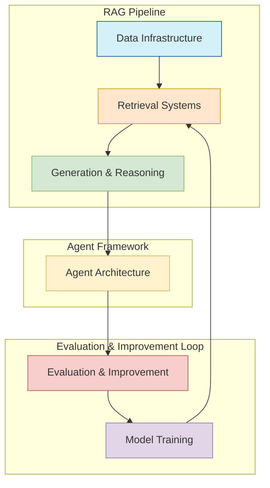
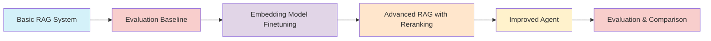

# AI Makerspace - AI Engineering Cheatsheet

This document provides a comprehensive analysis of the AI Engineering course material, which demonstrates a simple workflow for building, evaluating, and improving AI systems with Retrieval Augmented Generation (RAG), agents, and evaluation. The analysis examines the implementation details, architecture, and progressive improvement pattern that characterizes modern AI application development.

## Core Component Groups



## Progressive Improvement Workflow

The demo demonstrates a clear progression from basic to advanced implementations, following an iterative, improvement-driven development process:



This progressive improvement pattern is central to the demo, showing how each component evolves from basic to advanced implementations based on systematic evaluation and targeted enhancements.

## 1. Data Infrastructure

### Components
- **Document Loaders**: DirectoryLoader with BSHTMLLoader for HTML files
- **Text Splitters**: RecursiveCharacterTextSplitter (750 chunk size, 20-100 overlap)
- **Vector Databases**: In-memory Qdrant and FAISS
- **External Data Sources**: Simon Willison's blog articles, ArXiv, Tavily search

### Capabilities
- Loading and processing documents from various sources
- Chunking documents for retrieval optimization
- Metadata handling and document identification
- Dataset preparation and management

### Implementation Details
The data infrastructure serves as the foundation for the RAG system, handling the ingestion, processing, and storage of documents. The implementation uses LangChain's document loaders and text splitters to process HTML content, which are then stored in vector databases for semantic retrieval.

According to the LangChain documentation, "Document loaders help load data from different sources into a standardized Document object format, with options for lazy loading of large datasets" <sup>[1]</sup>. This implementation follows best practices by using specialized loaders for HTML content and splitting documents into semantic chunks for better retrieval.

### Code Snippets
```python
# Document loading
path = "data/"
loader = DirectoryLoader(path, glob="*.html")
docs = loader.load()

# Text splitting
text_splitter = RecursiveCharacterTextSplitter(chunk_size=750, chunk_overlap=100)
split_documents = text_splitter.split_documents(docs)

# Vector database setup
client = QdrantClient(":memory:")
client.create_collection(
    collection_name="ai_across_years",
    vectors_config=VectorParams(size=1536, distance=Distance.COSINE),
)
```

## 2. Retrieval Systems

### Components
- **Embedding Models**: 
  - OpenAI Embeddings (text-embedding-3-small)
  - Custom finetuned Snowflake Arctic Embed
- **Vector Search**: Basic k-nearest neighbors
- **Reranking**: CohereRerank for hybrid retrieval
- **Retrieval Methods**: Basic retriever, contextual compression retriever

### Capabilities
- Semantic search for relevant documents
- Hybrid retrieval combining vector search and reranking
- Customizable search parameters (k values, reranking size)
- Integration with multiple embedding providers

### Implementation Details
The retrieval system uses a two-phase approach for implementing effective RAG: initially using OpenAI embeddings for basic retrieval, then improving performance through custom-finetuned embeddings and reranking.

The Snowflake Arctic Embed model was chosen for finetuning because it offers "high-quality retrieval with inference efficiency" and supports "vector truncation via MRL to decrease vector size by 4x with less than 3% degradation in quality" <sup>[2]</sup>. This makes it an excellent candidate for finetuning for domain-specific retrieval tasks.

The implementation also uses contextual compression with CohereRerank, which, according to LangChain documentation, allows "retrieving only relevant portions of documents given a query, using various methods like LLM-based extractors/filters, embedding similarity filters, or combinations thereof via pipelines" <sup>[3]</sup>.

### Code Snippets
```python
# Basic retriever
embeddings = OpenAIEmbeddings(model="text-embedding-3-small")
vector_store = QdrantVectorStore(
    client=client,
    collection_name="ai_across_years",
    embedding=embeddings,
)
retriever = vector_store.as_retriever(search_kwargs={"k": 5})

# Improved retriever with reranking
def retrieve_adjusted(state):
  compressor = CohereRerank(model="rerank-v3.5", top_n=10)
  compression_retriever = ContextualCompressionRetriever(
    base_compressor=compressor, base_retriever=retriever, search_kwargs={"k": 5}
  )
  retrieved_docs = compression_retriever.invoke(state["question"])
  return {"context" : retrieved_docs}
```

## 3. Generation and Reasoning

### Components
- **LLM Models**: 
  - GPT-4.1-mini (for RAG generation)
  - GPT-4.1 (for agent reasoning)
  - GPT-4o (for improved agent)
- **Prompt Templates**: RAG response generation prompt
- **Response Generation**: Structured document-to-answer flow

### Capabilities
- Context-aware response generation
- Domain-specific answering
- Factual response synthesis from retrieved documents
- Temperature control for deterministic outputs

### Implementation Details
The generation and reasoning component handles the core LLM interaction, transforming retrieved context into coherent, factual responses. The implementation progressively upgrades the models used, starting with GPT-4.1-mini for basic RAG and advancing to GPT-4o for the fully-featured agent.

The RAG prompt follows best practices by clearly instructing the model to "only use the provided context," which is critical for reducing hallucinations. According to LangChain's RAG documentation, "Retrieval Augmented Generation (RAG) combines retrieval systems with language models to utilize external knowledge, access up-to-date information, leverage domain-specific expertise, reduce hallucination, and integrate knowledge cost-effectively" <sup>[4]</sup>.

The system employs LangChain's StateGraph for maintaining coherent state between retrieval and generation steps, which is important for ensuring that the context is properly integrated with the query.

### Code Snippets
```python
# RAG prompt template
RAG_PROMPT = """\
You are a helpful assistant who answers questions based on provided context. You must only use the provided context, and cannot use your own knowledge.

### Question
{question}

### Context
{context}
"""
rag_prompt = ChatPromptTemplate.from_template(RAG_PROMPT)

# Generation function
def generate(state):
  docs_content = "\n\n".join(doc.page_content for doc in state["context"])
  messages = rag_prompt.format_messages(question=state["question"], context=docs_content)
  response = llm.invoke(messages)
  return {"response" : response.content}
```

## 4. Agent Architecture

### Components
- **LangGraph Framework**: StateGraph for workflow management
- **Tool Definitions**: Custom RAG tool, Tavily search, ArXiv
- **State Management**: TypedDict for structured state
- **Tool Orchestration**: ToolNode for execution

### Capabilities
- Dynamic tool selection based on queries
- Multi-step reasoning with tool outputs
- Conditional workflow execution
- Tool-augmented LLM responses

### Implementation Details
The agent architecture uses LangGraph to orchestrate the workflow, implementing a ReAct (Reasoning and Acting) pattern for tool-augmented responses. According to LangGraph documentation, this architecture allows "building reliable, stateful AI systems, without giving up control" <sup>[5]</sup>.

The implementation follows the ReAct pattern where the agent "iteratively reasons about user queries and executes actions" <sup>[6]</sup>. This creates a flexible system that can dynamically decide whether to use tools or respond directly based on the query.

By using LangGraph's StateGraph, the system gains several advantages over traditional chains:
1. Ability to implement conditional logic based on LLM outputs
2. Support for cycles and iterative reasoning
3. Structured state management with TypedDict
4. Clean separation between reasoning (agent node) and action (tool node)

The tools integrated into this agent include:
- A custom RAG tool for domain-specific knowledge retrieval
- Tavily for general web search
- ArXiv for academic paper access

### Code Snippets
```python
# Tool definition
@tool
def ai_rag_tool(question: str) -> str:
  """Useful for when you need to answer questions about artificial intelligence. Input should be a fully formed question."""
  response = graph.invoke({"question" : question})
  return {
        "messages": [HumanMessage(content=response["response"])],
        "context": response["context"]
    }

# Agent state and execution
class AgentState(TypedDict):
  messages: Annotated[list, add_messages]
  context: List[Document]

def should_continue(state):
  last_message = state["messages"][-1]
  if last_message.tool_calls:
    return "action"
  return END
```

### Asynchronous Streaming Capabilities

The implementation demonstrates advanced asynchronous streaming capabilities with LangGraph, which is an important feature for modern LLM applications. The code includes:

```python
# Example of asynchronous streaming with LangGraph
async for chunk in compiled_graph.astream(inputs, stream_mode="updates"):
    for node, values in chunk.items():
        print(f"Receiving update from node: '{node}'")
        if node == "action":
          print(f"Tool Used: {values['messages'][0].name}")
        print(values["messages"])
        print("\n\n")
```

This enables real-time updates during agent execution, providing visibility into the agent's reasoning process and tool usage. The streaming capabilities are integral to LangGraph's design, as noted in its documentation: "streaming in LangGraph covers the main types (workflow progress, LLM tokens, custom updates) and streaming modes (values, updates, custom, messages, debug, events)" <sup>[7]</sup>.

## 5. Evaluation and Improvement

### Components
- **RAGAS Framework**: Comprehensive RAG evaluation metrics
- **Test Generation**: LLM-based test set creation
- **Result Parsing**: Custom parsers for tool outputs
- **Metric Calculation**: Multi-faceted quality assessment

### Capabilities
- Automated evaluation of RAG system quality
- Multi-metric assessment (context recall, faithfulness, etc.)
- Comparative analysis of system improvements
- Standardized evaluation benchmarks

### Implementation Details
The evaluation system uses RAGAS (Retrieval-Augmented Generation Assessment Suite), which is a framework designed to evaluate RAG models systematically. RAGAS combines various metrics to provide a holistic assessment of RAG performance <sup>[8]</sup>.

The key metrics implemented include:
1. **Context Recall**: Measures how well the retrieved context covers information needed to answer the question
2. **Faithfulness**: Evaluates whether the generated answer is consistent with the provided context
3. **Factual Correctness**: Assesses the factual accuracy of the generated answer
4. **Response Relevancy**: Measures how relevant the response is to the query
5. **Context Entity Recall**: Evaluates if the entities mentioned in the ground truth are present in the retrieved context
6. **Noise Sensitivity**: Tests how resilient the system is to noise in the context

These metrics collectively address multiple dimensions of RAG system quality, as noted in the RAGAS paper: "Evaluating RAG architectures is challenging because there are several dimensions to consider: the ability of the retrieval system to identify relevant and focused context passages, the ability of the LLM to exploit such passages in a faithful way, or the quality of the generation itself" <sup>[9]</sup>.

### Custom Context Parser

A significant component of the evaluation process is the `ContextParser` class, which is responsible for extracting and organizing context from different tool outputs. This class contains specialized methods for parsing results from Tavily, AI RAG, and ArXiv tools:

```python
class ContextParser:
    """Parser for extracting and organizing context from conversation messages."""

    @staticmethod
    def detect_tool_type(message: Any) -> Optional[str]:
        """Detect the tool type from the message."""
        try:
            if hasattr(message, 'name'):
                if 'tavily' in message.name:
                    return 'tavily'
                elif 'ai_rag' in message.name:
                    return 'ai_rag'
                elif 'arxiv' in message.name:
                    return 'arxiv'
            return None
        except Exception as e:
            print(f"Error detecting tool type: {str(e)}")
            return None

    @staticmethod
    def extract_content(message: Any) -> Optional[str]:
        """Extract content from a message object."""
        # Complex content extraction implementation...

    @staticmethod
    def parse_tavily_results(content: str) -> List[Dict]:
        """Parse Tavily search results from content string."""
        # Tavily-specific parsing logic...

    @staticmethod
    def parse_ai_rag_results(content: str) -> List[Dict]:
        """Parse AI RAG tool results from content string."""
        # RAG-specific parsing logic...

    @staticmethod
    def parse_arxiv_results(content: str) -> List[Dict]:
        """Parse arXiv results from content string."""
        # ArXiv-specific parsing logic...
```

This parser is crucial for bridging the gap between the agent's tool outputs and the RAGAS evaluation metrics, ensuring that the evaluation is performed on properly structured data.

### Code Snippets
```python
# Evaluation metrics
result = evaluate(
    dataset=evaluation_dataset,
    metrics=[LLMContextRecall(), Faithfulness(), FactualCorrectness(), 
             ResponseRelevancy(), ContextEntityRecall(), NoiseSensitivity()],
    llm=evaluator_llm,
    run_config=custom_run_config
)

# Improvement calculation
def calculate_metric_delta(run1: dict, run2: dict) -> dict:
    delta = {}
    for metric in run1:
        delta[metric] = round(run2[metric] - run1[metric], 4)
    return delta
```

## 6. Model Training

### Components
- **Embedding Model**: Snowflake Arctic Embed base model
- **Training Framework**: Sentence Transformers
- **Loss Functions**: MatryoshkaLoss with MultipleNegativesRankingLoss
- **Dataset Generation**: LLM-based question generation

### Capabilities
- Question-document pair generation for training
- Contrastive learning for embeddings
- Multi-resolution embeddings with matryoshka dimensions
- Domain adaptation of general embedding models

### Implementation Details
The model training component focuses on finetuning embedding models to improve domain-specific retrieval performance. The implementation uses Snowflake's Arctic Embed as the base model, which is "optimized for performance" in retrieval applications <sup>[10]</sup>.

A key feature of this implementation is the use of MatryoshkaLoss, which enables multi-resolution embeddings. According to Snowflake's documentation, Arctic Embed "delivers embeddings that are easily compressible" and allows "vector truncation via MRL to decrease vector size by 4x with less than 3% degradation in quality" <sup>[11]</sup>. This enables flexible deployment options where embeddings can be truncated for efficiency while maintaining most of their retrieval performance.

### LLM-based Question Generation for Training

A particularly innovative aspect of the implementation is the use of LLMs to generate training data for the embedding model. The process involves:

```python
# Question generation prompt
qa_prompt = """\
Given the following context, you must generate questions based on only the provided context.

You are to generate {n_questions} questions which should be provided in the following format:

1. QUESTION #1
2. QUESTION #2
...

Context:
{context}
"""

qa_prompt_template = ChatPromptTemplate.from_template(qa_prompt)

question_generation_chain = qa_prompt_template | qa_chat_model

# Processing documents in parallel with asyncio
async def process_document(document, n_questions):
    questions_generated = await question_generation_chain.ainvoke({"context": document.page_content, "n_questions": n_questions})
    
    doc_questions = {}
    doc_relevant_docs = {}
    
    for question in questions_generated.content.split("\n"):
        question_id = str(uuid.uuid4())
        doc_questions[question_id] = "".join(question.split(".")[1:]).strip()
        doc_relevant_docs[question_id] = [document.metadata["id"]]
    
    return doc_questions, doc_relevant_docs

async def create_questions(documents, n_questions):
    tasks = [process_document(doc, n_questions) for doc in documents]
    
    questions = {}
    relevant_docs = {}
    
    for task in tqdm(asyncio.as_completed(tasks), total=len(documents), desc="Processing documents"):
        doc_questions, doc_relevant_docs = await task
        questions.update(doc_questions)
        relevant_docs.update(doc_relevant_docs)
    
    return questions, relevant_docs
```

This approach follows the recommended practice for embedding model finetuning, where "after upgrading the fine-tuning data, we can use the Arctic Embed training code to fine-tune ourselves an embedding model that keeps pace with other leading models" <sup>[12]</sup>.

### Code Snippets
```python
# Embedding model training
model_id = "Snowflake/snowflake-arctic-embed-m"
model = SentenceTransformer(model_id)

matryoshka_dimensions = [768, 512, 256, 128, 64]
inner_train_loss = MultipleNegativesRankingLoss(model)
train_loss = MatryoshkaLoss(
    model, inner_train_loss, matryoshka_dims=matryoshka_dimensions
)

model.fit(
    train_objectives=[(loader, train_loss)],
    epochs=EPOCHS,
    warmup_steps=warmup_steps,
    output_path='finetuned_arctic_ft',
    show_progress_bar=True,
    evaluator=evaluator,
    evaluation_steps=50
)
```

## LangSmith Integration

The implementation includes LangSmith integration for tracing and debugging:

```python
os.environ["LANGSMITH_TRACING"] = "true"
os.environ["LANGSMITH_PROJECT"] = "AI Engineer Cheatsheet"
os.environ["LANGSMITH_API_KEY"] = getpass("LangSmith API Key: ")
```

This setup enables tracing and debugging of LangChain runs, which is crucial for development and troubleshooting of complex agent systems. LangSmith provides observability into the execution of LangChain applications, allowing developers to track and analyze the performance of each component. The dynamic project name generation with UUID ensures that each run can be uniquely identified in the LangSmith dashboard.

## Integration Workflow

The entire system demonstrates a full AI application development lifecycle with a focus on continuous improvement:

1. **Data Collection & Processing**: Load documents, split into chunks
2. **Initial RAG System**: Basic retrieval and generation
3. **Agent Integration**: Add tools and reasoning capabilities
4. **Evaluation**: Measure performance with RAGAS
5. **Improvement**: Finetune embeddings and add reranking
6. **Re-evaluation**: Confirm performance improvements

This workflow follows the modern AI application development pattern described in the LangChain documentation <sup>[13]</sup>, where the development process is iterative and improvement-driven. Each stage builds on the previous one, resulting in a progressively more capable system.

## Key Metrics & Results

The implementation shows significant improvements after finetuning and reranking:

| Metric | Baseline | Improved | Delta |
|--------|----------|----------|-------|
| Context Recall | 0.1926 | 0.2669 | +0.0743 |
| Faithfulness | 0.3870 | 0.5346 | +0.1476 |
| Factual Correctness | 0.3575 | 0.4217 | +0.0642 |
| Answer Relevancy | 0.8723 | 0.8698 | -0.0025 |
| Context Entity Recall | 0.2739 | 0.3179 | +0.0440 |
| Noise Sensitivity | 0.0657 | 0.0866 | +0.0209 |

These improvements demonstrate the value of domain-specific embedding finetuning and hybrid retrieval techniques in enhancing RAG system performance. The most significant improvement was in Faithfulness (+0.1476), which aligns with RAGAS documentation that defines this metric as "evaluating whether the generated answer is consistent with the provided context" <sup>[14]</sup>. Improving faithfulness is particularly important for RAG systems, as it ensures that the model is actually using the retrieved information rather than relying on its own internal knowledge.

The Context Recall improvement (+0.0743) indicates that the finetuned embeddings are better at retrieving information relevant to the query, while the improvements in Factual Correctness (+0.0642) show that the enhanced system produces more accurate responses. The only metric that slightly decreased was Answer Relevancy (-0.0025), but this minor drop is negligible compared to the substantial gains in other areas.

These results support the conclusion that embedding model finetuning combined with reranking offers a viable path to meaningful RAG system improvements.

## Advanced Patterns & Techniques

The implementation demonstrates several advanced patterns that are worth highlighting:

### 1. Hybrid Retrieval
The system uses a hybrid retrieval approach by combining vector similarity search with reranking. This follows best practices for modern RAG systems, which often perform better when using multiple retrieval methods in combination <sup>[15]</sup>. The CohereRerank component serves as a "contextual compressor" that filters and re-scores documents based on semantic relevance to the query.

### 2. Multi-Resolution Embeddings
By using MatryoshkaLoss during finetuning, the system creates embeddings that can be used at different dimensions (768, 512, 256, 128, 64). According to Snowflake's documentation, this allows for "vector truncation via MRL to decrease vector size by 4x with less than 3% degradation in quality" <sup>[11]</sup>. This gives flexibility to trade off between performance and efficiency at deployment time.

### 3. LLM-Generated Training Data
The implementation uses a novel approach for generating training data by leveraging LLMs to create question-document pairs. This technique is becoming increasingly common in AI development workflows, where LLMs serve as data generators for training other models. The approach follows the pattern described in various embedding model finetuning papers <sup>[16]</sup>.

### 4. ReAct Agent Pattern
The agent implementation follows the ReAct (Reasoning and Acting) pattern, which interleaves reasoning steps with actions. According to LangGraph documentation, this pattern allows agents to "iteratively reason about user queries and execute actions" <sup>[6]</sup>, creating more capable and reliable systems.

### 5. Comprehensive Evaluation
The RAGAS evaluation framework provides a multi-faceted assessment of the system's performance, looking at context quality, answer quality, and robustness. This comprehensive approach to evaluation is critical for RAG systems, which have many potential failure modes that simple metrics might miss.

## Logical Component Groupings

Based on the analysis, we can organize the components into several logical groupings that follow the development workflow and architectural concerns:

### 1. Core RAG Infrastructure
- Document loaders and processors
- Text splitters and chunking strategies
- Embedding models and vector databases
- Retrieval mechanisms and reranking

The core RAG infrastructure forms the foundation of the system, handling data ingestion, processing, storage, and retrieval. This grouping represents the essential components needed for any RAG system.

### 2. Agent Framework & Orchestration
- LangGraph state management
- Tool definitions and bindings
- Model integration and orchestration
- Conditional logic and workflow control

The agent framework builds on top of the RAG infrastructure, adding reasoning capabilities, tool usage, and complex workflow orchestration. This layer enables the system to make decisions about when to use tools and how to incorporate their outputs.

### 3. Evaluation & Training Pipeline
- RAGAS metrics and evaluation
- Test set generation
- Result parsing and analysis
- Embedding model training
- Dataset creation for finetuning

The evaluation and training pipeline focuses on measuring performance and improving the system through model finetuning and systematic comparison. This layer ensures continuous improvement and quality assessment.

### 4. Integration & Deployment Components
- LangSmith tracing and monitoring
- Model versioning and storage
- API interfaces and service integration

While not explicitly demonstrated in all aspects, the infrastructure for monitoring, deployment, and integration is represented through the use of LangSmith for tracing and the push to Hugging Face Hub for model storage.

This organization reflects the layered architecture of modern AI applications, with each layer building on the capabilities of the ones below it.

## Conclusion

The AI Makerspace Certification Challenge demo showcases a comprehensive approach to building, evaluating, and improving RAG systems and AI agents. The key innovations demonstrated include:

1. **LangGraph-based Agent Architecture**: The use of LangGraph for agent orchestration provides a flexible and powerful framework for building complex AI systems with state management, conditional routing, and tool integration.

2. **Embedding Model Finetuning**: The implementation demonstrates a complete workflow for improving domain-specific retrieval through embedding model finetuning, with measurable performance improvements.

3. **Systematic Evaluation**: The RAGAS evaluation framework offers a comprehensive assessment of RAG system quality, enabling data-driven improvement.

4. **Hybrid Retrieval**: The combination of vector search and reranking demonstrates how multiple retrieval techniques can be combined for better performance.

5. **End-to-End Development Workflow**: From data preparation to evaluation, the implementation showcases a complete development cycle for AI applications.

These components and techniques represent current best practices in AI application development, following the architectural patterns described in the LangChain and LangGraph documentation. The modular design allows for components to be improved or replaced independently, and the evaluation framework provides a systematic way to measure the impact of these changes.

For future development, the system could be enhanced with additional features such as:

- **Memory and persistence**: Adding conversation memory to the agent for more contextual responses
- **Human-in-the-loop capabilities**: Integrating user feedback and intervention points
- **More sophisticated tool integration**: Expanding the agent's capabilities with specialized tools
- **Deployment infrastructure**: Building out production-ready serving infrastructure with monitoring and scaling

Overall, this implementation provides an excellent reference architecture for building advanced AI systems with RAG, agent capabilities, and systematic evaluation.

## References

[1] LangChain Documentation, "Document Loaders," https://python.langchain.com/docs/concepts/document_loaders/

[2] Snowflake, "Snowflake Arctic Embed," https://huggingface.co/Snowflake/snowflake-arctic-embed-l-v2.0

[3] LangChain Documentation, "How to: use contextual compression to compress the data retrieved," https://python.langchain.com/docs/how_to/contextual_compression/

[4] LangChain Documentation, "Retrieval Augmented Generation (RAG)," https://python.langchain.com/docs/concepts/rag/

[5] LangGraph Documentation, "Agent architectures," https://langchain-ai.github.io/langgraph/concepts/agentic_concepts/

[6] LangGraph Documentation, "GitHub - langchain-ai/react-agent: LangGraph template for a simple ReAct agent," https://github.com/langchain-ai/react-agent

[7] LangGraph Documentation

[8] RAGAS Documentation, "A Beginner's Guide to Evaluating RAG Pipelines Using RAGAS," https://www.analyticsvidhya.com/blog/2024/05/a-beginners-guide-to-evaluating-rag-pipelines-using-ragas/

[9] RAGAS Paper, "Ragas: Automated Evaluation of Retrieval Augmented Generation," https://arxiv.org/abs/2309.15217

[10] Snowflake, "snowflake-arctic-embed," https://ollama.com/library/snowflake-arctic-embed

[11] Snowflake Documentation, "Snowflake/snowflake-arctic-embed-l-v2.0," https://huggingface.co/Snowflake/snowflake-arctic-embed-l-v2.0

[12] Snowflake Engineering Blog, "Snowflake Arctic Embed Joins ArcticTraining: Simple And Scalable Embedding Model Training," https://www.snowflake.com/en/engineering-blog/arctic-embed-joins-arctictraining/

[13] LangChain Documentation, "Concepts," https://python.langchain.com/docs/concepts/

[14] RAGAS Documentation, "Metrics - Ragas," https://docs.ragas.io/en/latest/concepts/metrics/

[15] LangChain Documentation, "How to: use hybrid vector and keyword retrieval," https://python.langchain.com/docs/how_to/hybrid/

[16] Arctic-Embed Paper, "Arctic-Embed: Scalable, Efficient, and Accurate Text Embedding Models," https://arxiv.org/html/2405.05374v1
