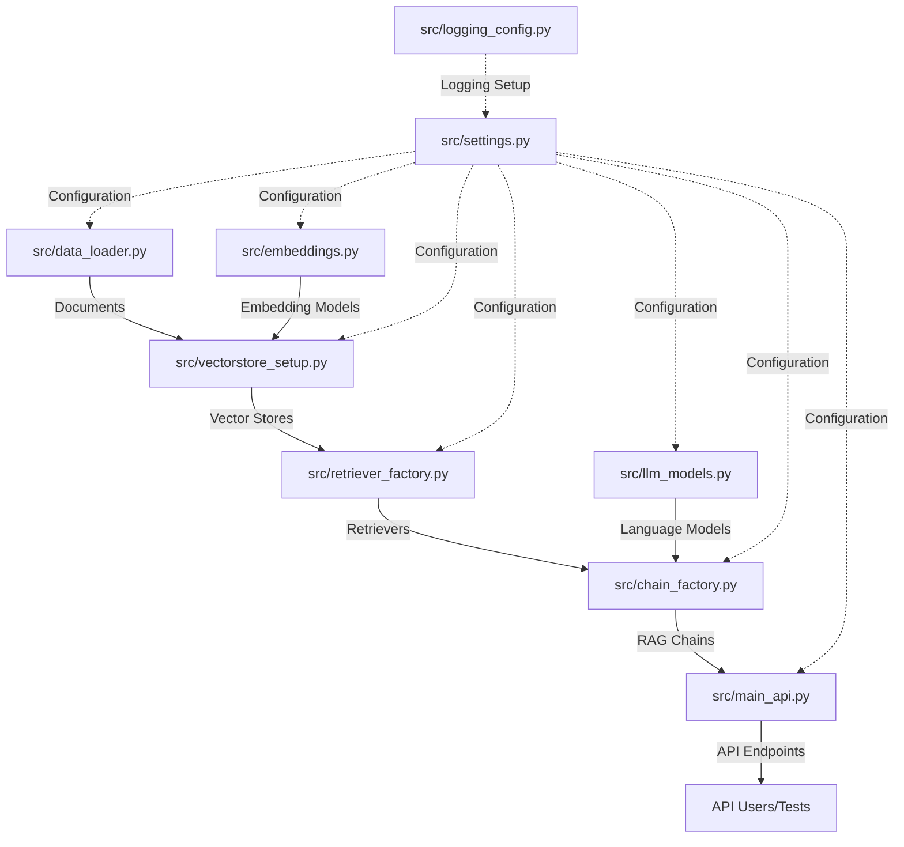

# Advanced RAG Retriever API with LangChain

This project demonstrates various advanced retrieval techniques using LangChain, exposed via a FastAPI application. It allows you to query information from John Wick movie reviews using different retriever setups.

## What You'll Learn

By working with this project, you'll gain practical experience with:

* Building Retrieval-Augmented Generation (RAG) systems using LangChain
* Understanding different retrieval strategies and their respective strengths
* Working with vector stores and embeddings in real applications
* Implementing and testing FastAPI endpoints for LLM applications
* Processing multimodal data (text, images, and structured data) in RAG pipelines
* Creating feedback loops for continuous RAG system improvement
* Implementing graph-based retrievers for complex reasoning tasks
* Developing resource-efficient RAG solutions for constrained environments
* Debugging and troubleshooting RAG components
* Creating modular, maintainable AI application architectures

## Learning Path

This project includes three main documents to guide your learning:

1. **README.md (this file)**: Practical guide for setup, usage, and basic troubleshooting
2. **[concepts.md](./retrieval-concepts.md)**: Core RAG concepts, component explanations, and examples
3. **[advanced_concepts.md](./retrieval-advanced-concepts.md)**: Advanced techniques, optimizations, and cutting-edge RAG approaches

We recommend following this progression to build from fundamentals to advanced understanding.

> **Last Updated:** May 2025 - Reflecting current best practices in RAG technology.

## Conceptual Overview

Before diving into the technical details, let's understand how this system works at a high level:

1. **Document Processing**: Movie review documents are loaded, processed, and stored in various vector stores.
2. **Retrieval Strategy**: When a question is asked, one of several retriever methods finds the most relevant documents.
3. **Context Generation**: The relevant documents are combined with the question to create context.
4. **LLM Response**: An LLM uses this context to generate an informed answer about the John Wick movies.

The system demonstrates multiple retrieval approaches (naive vector similarity, BM25 keyword matching, semantic chunking, etc.) that you can compare and evaluate.

> **Want to understand how these retrievers work and differ?** See the [detailed retriever comparison in concepts.md](./concepts.md#retriever-comparison).

## Project Structure

```
.
├── src/                        # Source code directory
│   ├── main_api.py             # FastAPI application exposing retriever chains
│   ├── chain_factory.py        # Creates and configures all RAG chains
│   ├── retriever_factory.py    # Creates and configures all retriever instances
│   ├── vectorstore_setup.py    # Sets up Qdrant vector stores
│   ├── data_loader.py          # Loads and preprocesses John Wick review CSVs
│   ├── embeddings.py           # Initializes embedding models
│   ├── llm_models.py           # Initializes language models
│   ├── settings.py             # Manages API keys and LangSmith configuration
│   └── logging_config.py       # Logging configuration
├── tests/                      # Test directory
│   └── test_api_endpoints.sh   # Script to test all API endpoints
├── docs/                       # Directory for downloaded data files (CSV)
│   ├── john_wick_1.csv         # Data file (downloaded if not present)
│   ├── john_wick_2.csv         # Data file (downloaded if not present)
│   ├── john_wick_3.csv         # Data file (downloaded if not present)
│   └── john_wick_4.csv         # Data file (downloaded if not present)
├── run.py                      # Script to run the API
├── .env.example                # Example environment file template
├── .env                        # Local environment file (gitignored)
├── concepts.md                 # Explanation of core RAG concepts
├── advanced_concepts.md        # Advanced RAG techniques and optimizations
├── logs/                       # Directory for log files (gitignored)
│   ├── app.log                 # Main application log
│   └── api_test_results_*.log  # Logs from the test script
└── README.md                   # This file
```

## Prerequisites

1.  **Python 3.8+**
2.  **PIP** (Python package installer)
3.  **API Keys**:
    *   OpenAI API Key (for text and multimodal models)
    *   Cohere API Key
    *   LangSmith API Key (Optional, for tracing)
4.  **Additional Dependencies for Multimodal Processing**:
    *   CLIP or similar vision models for image processing
    *   FFmpeg for video frame extraction (for multimodal examples)
    *   Neo4j (for GraphRAG examples)

## Setup Instructions

1.  **Clone/Download Files**:
    Ensure all project files are downloaded.

2.  **Data Files**: 
    The required John Wick movie review CSV files (`jw1.csv` to `jw4.csv`) will be automatically downloaded into a `docs/` subdirectory if they are not found there when the application runs (specifically, when `src/data_loader.py` is imported or its `load_documents()` function is called).
    You no longer need to manually download them, but an internet connection will be required for the first run if they are not present.

3.  **Set Up Environment Variables**:
    This project uses a `.env` file to manage API keys and other settings. 
    a.  Copy the `.env.example` file to a new file named `.env` in the root of the project directory.
        ```bash
        cp .env.example .env
        ```
    b.  Open the `.env` file and replace the placeholder values (e.g., `YOUR_OPENAI_API_KEY_HERE`) with your actual API keys.

    The `src/settings.py` script will automatically load these variables. Alternatively, it will fall back to checking OS-level environment variables if a `.env` file is not present or a specific key is missing from it.

4.  **Install Dependencies**:
    Navigate to the project directory in your terminal and install the required Python packages. Ensure you have `pip` or `uv` (recommended) installed.

    Using `uv` (recommended, if `pyproject.toml` is set up):
    ```bash
    uv pip install -r requirements.txt  # If you generate one from pyproject.toml
    # OR directly if your uv version and pyproject.toml supports it well for all packages
    # uv pip install .
    ```

    Using standard `pip`:
    ```bash
    pip install fastapi uvicorn langchain langchain-openai langchain-cohere rank_bm25 qdrant-client langchain-qdrant langchain-experimental pydantic python-dotenv
    ```
    (Note: `python-dotenv` is a new addition for `.env` file support).

    If you are managing dependencies with `uv` and have a `pyproject.toml` file, you can add `python-dotenv>=0.21.0` to your dependencies list in `pyproject.toml` and run `uv pip install .` or `uv sync`.

### Common Installation Issues

* **Package version conflicts**: This project has been tested with LangChain 0.1.0+ and LangChain Extensions 0.1.0+. If you encounter errors, try specifying these versions.
* **OpenAI API errors**: Ensure you're using the latest langchain-openai package which supports the current OpenAI API.
* **Memory errors with Qdrant**: If you encounter memory issues, try adjusting the number of documents processed by setting a limit in data_loader.py.
* **Python version compatibility**: This code is tested with Python 3.8 through 3.11. Earlier or newer versions may require adjustments.
* **Missing libomp error on macOS**: Install it with `brew install libomp` if you encounter this error.
* **Multimodal dependencies**: For multimodal examples, ensure you have installed the necessary packages: `pip install pillow opencv-python transformers torch`.
* **Neo4j connection issues**: For GraphRAG examples, make sure Neo4j is properly installed and accessible at the specified URL.

## Running the Application

Once the setup is complete, you can run the FastAPI application.

1.  **Navigate to the Directory**:
    Open your terminal and change to the directory where you saved all the files.

2.  **Start the Server**:
    You can run the application using the provided `run.py` script:

    ```bash
    python run.py
    ```

    Alternatively, you can run the application using `uvicorn` directly:

    ```bash
    uvicorn src.main_api:app --reload
    ```

    The server will typically start on `http://127.0.0.1:8000`.
    The `--reload` flag with `uvicorn` enables auto-reloading when code changes are detected, which is useful for development.

## Using the API Endpoints

The FastAPI application exposes several endpoints, one for each retriever chain. You can interact with these using tools like `curl`, Postman, or any HTTP client.

All endpoints are `POST` requests and expect a JSON payload with a `question` field.

**Example Request Payload**:

```json
{
  "question": "Did people generally like John Wick?"
}
```

**Example Response Payload**:

```json
{
  "answer": "Yes, people generally liked John Wick. Many reviews praise its action sequences, Keanu Reeves' performance, and the world-building.",
  "context_document_count": 10
}
```

### Available Endpoints:

*   `POST /invoke/naive_retriever`
*   `POST /invoke/bm25_retriever`
*   `POST /invoke/contextual_compression_retriever`
*   `POST /invoke/multi_query_retriever`
*   `POST /invoke/parent_document_retriever`
*   `POST /invoke/ensemble_retriever`
*   `POST /invoke/semantic_retriever`

### Example using `curl`:

```bash
curl -X POST "http://127.0.0.1:8000/invoke/naive_retriever" \
-H "Content-Type: application/json" \
-d '{"question":"What are some common themes in the John Wick movies?"}'
```

Replace `naive_retriever` with any other retriever endpoint name as needed.

### Example using Python:

```python
import requests
import json

url = "http://127.0.0.1:8000/invoke/naive_retriever"
payload = {"question": "What are some common themes in the John Wick movies?"}
headers = {"Content-Type": "application/json"}

response = requests.post(url, headers=headers, data=json.dumps(payload))
result = response.json()

print(f"Answer: {result['answer']}")
print(f"Documents used: {result['context_document_count']}")
```

### Response Times

RAG systems typically take longer to respond than simple APIs due to several processing steps:
1. Embedding your question (typically 500ms-1s)
2. Searching the vector store (100ms-500ms)
3. Processing through the LLM (1-5s depending on model)

Expect total response times between 2-7 seconds per query. The first query after starting the server may be slower due to initialization.

### Interactive API Documentation (Swagger UI)

Once the FastAPI server is running, you can access interactive API documentation by navigating to `http://127.0.0.1:8000/docs` in your web browser. This interface allows you to explore and test the endpoints directly.

## Logging

All Python modules in this application are configured to log to both the console and a rotating file located at `logs/app.log`. 
*   The file log (`logs/app.log`) will rotate when it reaches 1MB, keeping up to 5 backup files.
*   Console logs are useful for real-time monitoring during development.

The `tests/test_api_endpoints.sh` script also stores its detailed output in a timestamped file within the `logs/` directory (e.g., `logs/api_test_results_YYYYMMDD_HHMMSS.log`).

The `logs/` directory is ignored by Git.

## System Architecture and Component Testing

Understanding the system architecture and how components interact is crucial for effective development and troubleshooting. The following diagram illustrates the dependencies between components and the flow of data through the system.



### Component Testing Strategy

The system is designed with modularity in mind, allowing each component to be tested independently. This helps isolate issues and understand the system better. Below is a recommended sequence for testing components:

1. **Environment Setup**: First, ensure environment variables are properly set up
   ```bash
   # Check if .env file exists and contains required values
   cat .env
   ```
   *If this fails*: Ensure .env exists and contains all required keys. Check for typos or formatting errors.

2. **Data Loading**: Test document loading functionality
   ```bash
   python -m src.data_loader
   ```
   *Expected outcome*: Success messages showing documents were loaded from CSV files in the `docs/` directory.
   
   *If this fails*: 
   - Check internet connection if files need to be downloaded
   - Ensure `docs/` directory is writable
   - Look for HTTP errors in logs for download failures
   - Verify CSV format if files exist but parsing fails

3. **Embedding Models**: Verify embedding models initialization
   ```bash
   python -m src.embeddings
   ```
   *Expected outcome*: Confirmation that embedding models were successfully initialized.
   
   *If this fails*:
   - Verify your OpenAI API key is valid and has sufficient credits
   - Check if you're hitting rate limits (look for 429 errors)
   - Ensure network connectivity to OpenAI's API
   - Try specifying an older embedding model if the latest is giving errors

4. **Vector Stores**: Test vector store creation using documents and embeddings
   ```bash
   python -m src.vectorstore_setup
   ```
   *Expected outcome*: Success messages for each vector store collection with point counts where available.
   
   *If this fails*:
   - Examine error messages for memory issues (Qdrant can be memory-intensive)
   - Check if document loading was successful (empty documents list)
   - Look for embedding dimension mismatch errors
   - Verify Qdrant client is properly initialized

5. **Retrievers**: Test retriever initialization using vector stores
   ```bash
   python -m src.retriever_factory
   ```
   *Expected outcome*: Confirmation that retrievers were successfully initialized.
   
   *If this fails*:
   - Check if vector stores were properly created
   - For BM25, ensure documents have text content
   - For MultiQuery, verify LLM access
   - For ContextualCompression, check Cohere API access

6. **RAG Chains**: Test chain creation using retrievers and language models
   ```bash
   python -m src.chain_factory
   ```
   *Expected outcome*: Confirmation that chains were successfully created.
   
   *If this fails*:
   - Verify all retrievers are available
   - Check LLM initialization and API access
   - Look for prompt template errors
   - Ensure chain components are compatible

7. **API Integration Testing**: Test API endpoints using the provided script
   ```bash
   chmod +x tests/test_api_endpoints.sh
   ./tests/test_api_endpoints.sh
   ```
   *Expected outcome*: HTTP Status 200 for all requests and meaningful responses.
   
   *If this fails*:
   - Check if server is running on expected port
   - Review specific endpoint errors (some may work while others fail)
   - Look for timeout issues with slower retrievers
   - Examine JSON parsing errors in request/response

### Troubleshooting Tips

- **Missing Documents**: If `data_loader.py` fails, check the `docs/` directory and internet connection for file downloads
- **API Key Issues**: Check the `.env` file or environment variables if any LLM or embedding initialization fails
- **Empty Vector Stores**: Check logs for document loading issues if vector stores are created but empty
- **Chain Initialization Failures**: Look for specific error messages about missing retrievers or LLMs
- **API Response Errors**: Check retrievers and chains when endpoints return errors

The modularity of this architecture allows you to identify exactly where the issue is occurring in the pipeline. Start testing from the bottom of the dependency chain (data_loader) and move upward to systematically diagnose any problems.

## Validating Application Health and Vector Store Status

Understanding if the application and its components, especially the in-memory vector stores, are functioning correctly is crucial.

### 1. FastAPI Application Startup Logs

When you start the application (e.g., `python run.py` or `uvicorn src.main_api:app --reload`), pay close attention to the initial console output. The `lifespan` event in `src/main_api.py` is designed to check and report the status of each retrieval chain:

```log
FastAPI application startup...
Initializing components and chains (within lifespan event)...

--- Chain Initialization Status (from lifespan event) ---
[+] Naive Retriever Chain: Ready
[+] BM25 Retriever Chain: Ready
[+] Contextual Compression Chain: Ready
[+] Multi-Query Chain: Ready
[+] Parent Document Chain: Ready
[+] Ensemble Chain: Ready
[+] Semantic Chain: Ready

All chains initialized successfully.
------------------------------------------------------
INFO:     Uvicorn running on http://127.0.0.1:8000 (Press CTRL+C to quit)
```

*   **`[+] ChainName: Ready`**: Indicates the chain and its underlying components (including necessary vector stores) likely initialized correctly.
*   **`[-] ChainName: Not available`**: Signals an issue. Check earlier logs for specific warnings (e.g., "No documents loaded," "Main vectorstore not available").

### 2. API Endpoint Testing Script (`tests/test_api_endpoints.sh`)

Use the provided bash script to test all API endpoints:

```bash
chmod +x tests/test_api_endpoints.sh
./tests/test_api_endpoints.sh
```

```bash
# Windows Powershell
.\tests\test_api_endpoints.ps1
```

This script sends predefined questions to each endpoint and logs the HTTP status codes and responses to a timestamped file in the `logs/` directory (e.g., `logs/api_test_results_YYYYMMDD_HHMMSS.log`) and also prints to console.
*   Look for `Status Code: 200` for each request.
*   Examine the responses to ensure they are sensible. Review the log file in `logs/` for a complete record.

### 3. Individual Module Tests

Most modules (e.g., `src/data_loader.py`, `src/embeddings.py`, `src/retriever_factory.py`, `src/chain_factory.py`) have an `if __name__ == "__main__":` block. Running them directly can help isolate issues:

```bash
python -m src.data_loader
python -m src.retriever_factory
# etc.
```

If these checks indicate issues, review the prerequisites (API keys in `.env`), data file download status (check `docs/` directory and console logs), and any error messages in the console or `logs/app.log` for further clues.

### 4. Standalone Vector Store Check (`src/vectorstore_setup.py`)

To specifically check the vector store creation process, run `vectorstore_setup.py` directly from your terminal:

```bash
python -m src.vectorstore_setup
```

This script will attempt to initialize all vector stores and print status messages, including point counts for collections where feasible. Example output:

```log
Setting up vector stores...
Main vector store initialized for collection: JohnWickMain
Parent document vector store initialized for collection: full_documents
-> Points in 'full_documents': XXX
Semantic vector store initialized for collection: JohnWickSemantic
```

*   Successful initialization messages and point counts are good indicators. Check `logs/app.log` for detailed startup sequence if running the FastAPI app, or console output if running `src/vectorstore_setup.py` directly.
*   **Note on In-Memory Stores**: The vector stores in this project (`location=":memory:"`) are not persistent. They are created when the application starts (or when `vectorstore_setup.py` is run) and are lost when the application stops. They do not have an external API/URL for inspection; all checks are programmatic via the application's logs or direct script execution.

## Practice Exercises

To strengthen your understanding of this RAG system, try these hands-on activities:

1. **Endpoint Comparison**: Send the same question to different retriever endpoints and compare the answers. Which retriever provides the most accurate responses for different types of questions?

2. **Chain Modification**: Try modifying the number of retrieved documents (k) in the `retriever_factory.py` file for one of the retrievers. How does this affect the answers?

3. **Custom Question Set**: Create a set of 5-10 questions about John Wick movies that test different aspects of retrieval (e.g., factual recall, opinion analysis, comparison questions).

## Next Steps

Ready to dive deeper? Check out:

1. [concepts.md](./concepts.md) to understand the theoretical foundations behind the RAG components.

2. [advanced_concepts.md](./advanced_concepts.md) for cutting-edge RAG techniques, optimizations, and advanced implementations.
