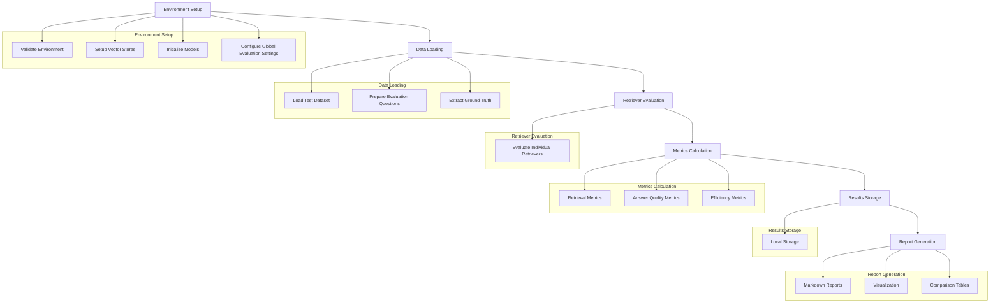
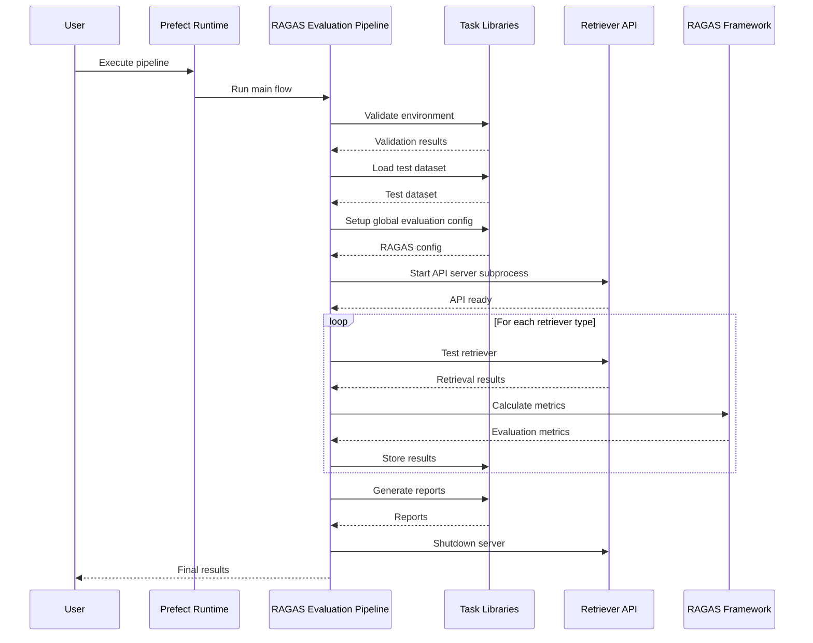
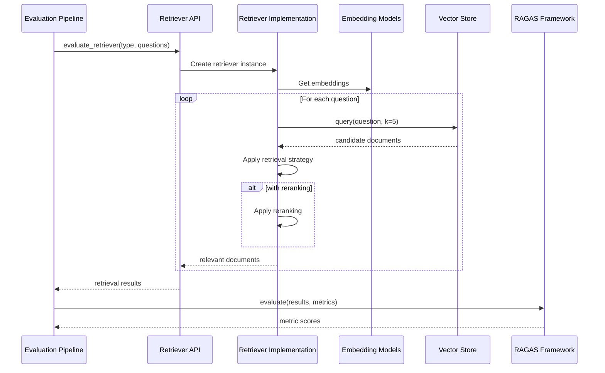
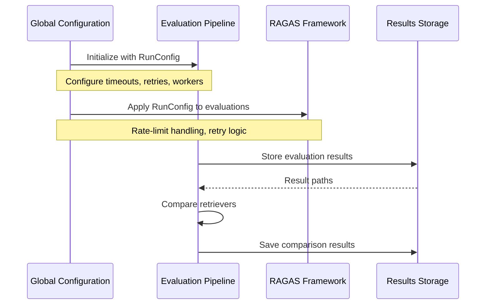
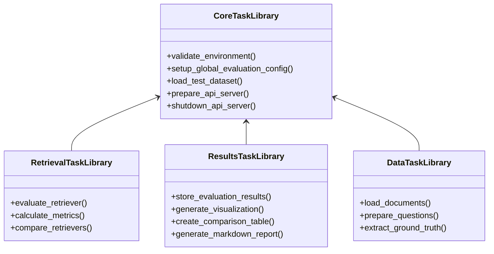

# RAGAS Retriever Evaluation Pipeline Architecture

## Overview

The RAGAS Retriever Evaluation Pipeline is designed to systematically evaluate and compare the performance of different retrieval strategies implemented in the Advanced RAG Retriever API. This Prefect-based pipeline leverages existing code and artifacts to provide comprehensive evaluation capabilities.

## Goals

1. Evaluate the performance of different retriever types (naive, BM25, contextual compression, etc.)
2. Calculate standardized metrics for comparing retriever performance
3. Generate visual reports and actionable insights
4. Track performance changes over time
5. Mitigate API rate limiting issues through optimal configuration
6. Provide a modular, maintainable architecture for future extensions

## Architecture Components

### 1. Core Pipeline Components



### 2. Sequence Diagrams

To better illustrate the interaction between components and the flow of data through the system, the following sequence diagrams provide a detailed view of the pipeline's execution:

#### 2.1. Main Pipeline Flow Sequence



#### 2.2. Retriever Evaluation Sequence



#### 2.3. Global Configuration and Data Flow



#### 2.4. Task Library Organization



### 3. Global Evaluation Configuration

The pipeline implements a global configuration approach for RAGAS evaluations to ensure consistency across all retriever comparisons and mitigate API rate limiting issues:

```python
from ragas import evaluate, RunConfig
from ragas.llms import LangchainLLMWrapper
from langchain_openai import ChatOpenAI
from ragas.metrics import (
    LLMContextRecall,
    Faithfulness,
    FactualCorrectness,
    ResponseRelevancy,
    ContextEntityRecall,
    NoiseSensitivity,
)

@task(
    name="setup-global-evaluation-config",
    description="Configures global settings for RAGAS evaluations",
    tags=["setup", "ragas"]
)
def setup_global_evaluation_config(llm_model: str = "gpt-4.1-mini") -> Dict[str, Any]:
    """
    Sets up global evaluation configuration for RAGAS.
    
    Args:
        llm_model: Model to use for evaluation
        
    Returns:
        Dictionary with configured evaluation components
    """
    # Configure evaluation LLM
    evaluator_llm = LangchainLLMWrapper(ChatOpenAI(model=llm_model))
    
    # Configure runtime settings to handle rate limits
    evaluator_config = RunConfig(
        timeout=300,          # 5 minutes max for operations
        max_retries=15,       # More retries for rate limits
        max_wait=90,          # Longer wait between retries
        max_workers=8,        # Fewer concurrent API calls
        log_tenacity=True     # Log retry attempts
    )
    
    # Configure standard metrics for evaluation
    evaluator_metrics = [
        LLMContextRecall(),
        Faithfulness(),
        FactualCorrectness(),
        ResponseRelevancy(),
        ContextEntityRecall(),
        NoiseSensitivity()
    ]
    
    return {
        "llm": evaluator_llm,
        "config": evaluator_config,
        "metrics": evaluator_metrics
    }
```

Key benefits of this approach:
- **Consistency**: Uses the same evaluation model and configuration for all retrievers
- **Rate Limit Handling**: Configures optimal retry mechanisms with exponential backoff
- **Resource Management**: Limits concurrent API calls to avoid throttling
- **Monitoring**: Logs retry attempts for transparency
- **Flexibility**: Allows using stronger evaluation models (e.g., gpt-4o) when needed

### 4. Key Tasks

| Task Name | Description | Retries | Dependencies |
|-----------|-------------|---------|--------------|
| `validate_environment` | Validates required environment variables | 3 | None |
| `setup_global_evaluation_config` | Configures global RAGAS settings | 1 | `validate_environment` |
| `load_test_dataset` | Loads test dataset from file or HuggingFace | 2 | `validate_environment` |
| `prepare_api_server` | Starts API server in subprocess | 2 | `validate_environment` |
| `evaluate_retriever` | Evaluates a single retriever against test questions | 1 | `load_test_dataset`, `prepare_api_server`, `setup_global_evaluation_config` |
| `calculate_metrics` | Calculates performance metrics | 1 | `evaluate_retriever` |
| `store_evaluation_results` | Saves results to disk | 2 | `calculate_metrics` |
| `generate_evaluation_report` | Creates a comprehensive report | 1 | `store_evaluation_results` |
| `shutdown_api_server` | Stops the API server | 1 | All evaluation tasks complete |

### 5. Evaluation Metrics

#### Retrieval Performance Metrics
- **Precision**: Proportion of retrieved documents that are relevant
- **Recall**: Proportion of relevant documents that are retrieved
- **F1 Score**: Harmonic mean of precision and recall
- **Mean Reciprocal Rank (MRR)**: Average of reciprocal ranks of relevant documents
- **Normalized Discounted Cumulative Gain (NDCG)**: Measures ranking quality

#### RAGAS-Specific Metrics (Implemented via Global Configuration)
- **LLM Context Recall**: Measures if the retrieved context contains information needed to answer the question
- **Faithfulness**: Evaluates if the answer is factually consistent with the retrieved context
- **Factual Correctness**: Assesses the factual accuracy of the generated answer
- **Response Relevancy**: Measures how well the answer addresses the question
- **Context Entity Recall**: Evaluates if important entities from the question are present in the context
- **Noise Sensitivity**: Assesses how robust the system is to irrelevant context

#### Efficiency Metrics
- **Latency**: Response time for retrieval and answer generation
- **Token Usage**: Number of tokens consumed
- **Context Efficiency**: Ratio of useful context to total context size

#### Custom John Wick Dataset Metrics
- **Movie Reference Accuracy**: Accuracy of movie-specific references
- **Character Recognition**: Accuracy in recognizing character mentions
- **Plot Element Coverage**: Coverage of important plot elements

### 6. Main Flow Design

```python
@flow(
    name="RAGAS Retriever Evaluation Pipeline",
    description="Evaluates various retriever strategies using RAGAS metrics",
    log_prints=True,
    version=os.environ.get("PIPELINE_VERSION", "1.0.0"),
    task_runner=ConcurrentTaskRunner()
)
def ragas_evaluation_pipeline(
    test_dataset_path: str = "data/test_dataset.json",
    hf_dataset_repo: str = "",
    output_dir: str = "evaluation_results/",
    retriever_types: List[str] = None,
    evaluation_metrics: List[str] = None,
    generate_report: bool = True,
    llm_model: str = "gpt-4.1-mini",
    embedding_model: str = "text-embedding-3-small",
    # Component enablement flags for partial execution
    run_environment_setup: bool = True,
    run_data_loading: bool = True,
    run_retriever_evaluation: bool = True,
    run_metrics_calculation: bool = True,
    run_results_storage: bool = True,
    run_report_generation: bool = True,
    skip_api_server: bool = False,
    reuse_cached_data: bool = False
) -> Dict[str, Any]:
    """
    Orchestrates the evaluation of different retriever strategies.
    
    Args:
        test_dataset_path: Path to local test dataset
        hf_dataset_repo: HuggingFace dataset repository (alternative to local)
        output_dir: Directory for evaluation results
        retriever_types: List of retriever types to evaluate
        evaluation_metrics: List of metrics to calculate
        generate_report: Whether to generate a report
        llm_model: LLM model for evaluation
        embedding_model: Embedding model for evaluation
        run_environment_setup: Enable/disable environment setup phase
        run_data_loading: Enable/disable data loading phase
        run_retriever_evaluation: Enable/disable retriever evaluation phase
        run_metrics_calculation: Enable/disable metrics calculation phase
        run_results_storage: Enable/disable results storage phase
        run_report_generation: Enable/disable report generation phase
        skip_api_server: Skip starting the API server (use existing)
        reuse_cached_data: Attempt to reuse cached datasets and results
        
    Returns:
        Dictionary with evaluation results and metrics
    """
    results = {}
    dataset = None
    api_process = None
    evaluation_config = None
    
    # Set up global evaluation configuration
    if run_environment_setup:
        evaluation_config = setup_global_evaluation_config.with_options(
            cache_key_fn=task_input_hash if reuse_cached_data else None,
            cache_expiration=timedelta(days=1) if reuse_cached_data else None
        )(llm_model=llm_model)
    
    # Load test dataset
    if run_data_loading:
        dataset = load_test_dataset.with_options(
            cache_key_fn=task_input_hash if reuse_cached_data else None,
            cache_expiration=timedelta(days=1) if reuse_cached_data else None
        )(test_dataset_path, hf_dataset_repo)
    
    # Prepare API server if needed
    if not skip_api_server and (run_retriever_evaluation or run_metrics_calculation):
    api_process = prepare_api_server()
    
    # Evaluate each retriever type
    if run_retriever_evaluation and dataset and evaluation_config:
    for retriever_type in retriever_types or DEFAULT_RETRIEVER_TYPES:
        # Evaluate retriever
            retriever_result = evaluate_retriever.with_options(
                cache_key_fn=task_input_hash if reuse_cached_data else None,
                cache_expiration=timedelta(days=1) if reuse_cached_data else None
            )(
            retriever_type=retriever_type,
            dataset=dataset,
            config=evaluation_config
        )
        
        # Calculate metrics
            if run_metrics_calculation:
        metrics = calculate_metrics(
            retriever_result=retriever_result,
            config=evaluation_config
        )
        
        # Store results
                if run_results_storage:
        store_evaluation_results(
            retriever_type=retriever_type,
            metrics=metrics,
            output_dir=output_dir
        )
        
        results[retriever_type] = metrics
    
    # Generate report if requested
    if run_report_generation and generate_report and results:
        report = generate_evaluation_report(
            results=results,
            output_dir=output_dir
        )
    
    # Clean up
    if api_process and not skip_api_server:
    shutdown_api_server(api_process)
    
    return results
```

### 7. Integration with Existing Code

The evaluation pipeline will create completely new reusable task libraries rather than directly reusing or adapting existing code. This approach provides better modularity, maintainability, and testability, while allowing the libraries to be improved over time based on lessons learned from the current implementation.

Key libraries to be created include:

1. **`evaluation_core`**: Core components like environment validation and global configuration
   ```python
   # evaluation_core/validation.py
   @task(name="validate-environment", ...)
   def validate_environment() -> Dict[str, List[str]]:
       """Validates that all required environment variables are set."""
       # Implementation
   
   # evaluation_core/config.py
   @task(name="setup-global-evaluation-config", ...)
   def setup_global_evaluation_config(llm_model: str = "gpt-4.1-mini") -> Dict[str, Any]:
       """Sets up global evaluation configuration for RAGAS."""
       # Implementation
   ```

2. **`evaluation_data`**: Data handling tasks
   ```python
   # evaluation_data/loaders.py
   @task(name="load-test-dataset", ...)
   def load_test_dataset(test_dataset_path: str, hf_dataset_repo: str = "") -> Any:
       """Loads test dataset from file or HuggingFace."""
       # Implementation
   ```

3. **`evaluation_retrieval`**: Retriever testing functionality
   ```python
   # evaluation_retrieval/api.py
   @task(name="prepare-api-server", ...)
   def prepare_api_server() -> subprocess.Popen:
       """Starts the API server in a subprocess."""
       # Implementation
   
   @task(name="evaluate-retriever", ...)
   def evaluate_retriever(retriever_type: str, dataset: Any, config: Dict[str, Any]) -> Any:
       """Evaluates a single retriever against test questions."""
       # Implementation
   ```

4. **`evaluation_results`**: Results storage and visualization
   ```python
   # evaluation_results/storage.py
   @task(name="store-evaluation-results", ...)
   def store_evaluation_results(retriever_type: str, metrics: Dict[str, float], output_dir: str) -> str:
       """Saves evaluation results to disk."""
       # Implementation
   
   # evaluation_results/reporting.py
   @task(name="generate-evaluation-report", ...)
   def generate_evaluation_report(results: Dict[str, Dict[str, float]], output_dir: str) -> str:
       """Creates a comprehensive evaluation report."""
       # Implementation
   ```

These libraries will incorporate patterns and lessons learned from existing code, but will be designed from the ground up with reusability, testing, and documentation as primary concerns.

### 8. Patterns from Existing Prefect Flows

The following patterns from existing Prefect flows (`prefect_pipeline_v2.py` and `prefect_docloader_pipeline.py`) will be incorporated into the new task libraries:

1. **Artifact Creation for Observability**
   ```python
   @task(name="store-evaluation-results", ...)
   def store_evaluation_results(retriever_type: str, metrics: Dict[str, float], output_dir: str) -> str:
       """Saves evaluation results to disk with comprehensive artifacts."""
       logger = get_run_logger()
       
       # Save to disk
       os.makedirs(output_dir, exist_ok=True)
       result_path = f"{output_dir}/{retriever_type}_results.json"
       with open(result_path, "w") as f:
           json.dump(metrics, f, indent=2)
       
       # Create table artifact for metrics
       create_table_artifact(
           key=f"metrics-{retriever_type}",
           table=pd.DataFrame([metrics]),
           description=f"Evaluation metrics for {retriever_type}"
       )
       
       # Create link artifact for result file
       create_link_artifact(
           key=f"result-file-{retriever_type}",
           link=f"file://{os.path.abspath(result_path)}",
           description=f"Full results for {retriever_type}"
       )
       
       # Log completion
       logger.info(f"Stored evaluation results for {retriever_type} at {result_path}")
       return result_path
   ```

2. **Comprehensive Task Tags and Descriptions**
   ```python
   @task(
       name="evaluate-retriever",
       description="Evaluates a specific retriever against test questions",
       retries=2,
       retry_delay_seconds=30,
       tags=["evaluation", "retriever", "api"]
   )
   def evaluate_retriever(...):
       """
       Detailed docstring with parameter descriptions and return value information.
       """
       # Implementation
   ```

3. **Fault-Tolerant Resource Management**
   ```python
   @task(
       name="prepare-api-server",
       description="Starts the API server in a subprocess and ensures it's ready",
       retries=3,
       retry_delay_seconds=10,
       tags=["setup", "api"]
   )
   def prepare_api_server(port: int = 8000) -> subprocess.Popen:
       """Starts the API server in a subprocess and ensures it's healthy."""
       logger = get_run_logger()
       
       # Start server
       process = subprocess.Popen(["python", "run.py", "--port", str(port)])
       
       # Wait for server to be ready
       server_url = f"http://localhost:{port}/health"
       max_attempts = 10
       wait_seconds = 2
       
       for attempt in range(max_attempts):
           try:
               logger.info(f"Checking if server is ready (attempt {attempt+1}/{max_attempts})")
               response = requests.get(server_url, timeout=5)
               if response.status_code == 200:
                   logger.info(f"Server is ready at {server_url}")
                   return process
           except Exception as e:
               logger.warning(f"Server not ready yet: {str(e)}")
           
           time.sleep(wait_seconds)
       
       # If we get here, the server failed to start
       process.terminate()
       raise RuntimeError(f"Failed to start API server after {max_attempts} attempts")
   ```

4. **Task State Handling with Prefect Events**
   ```python
   @task
   def evaluate_retriever(retriever_type: str, dataset: Any, config: Dict[str, Any]) -> Any:
       """Evaluates a single retriever against test questions."""
       logger = get_run_logger()
       
       try:
           logger.info(f"Starting evaluation of {retriever_type} retriever")
           # Implementation
           
           logger.info(f"Successfully evaluated {retriever_type} retriever")
           from prefect.events import emit_event
           emit_event(
               event=f"retriever-evaluation/{retriever_type}/success",
               resource={"prefect.resource.id": f"retriever:{retriever_type}"},
               payload={"retriever_type": retriever_type, "status": "success"}
           )
           return result
       except Exception as e:
           logger.error(f"Error evaluating {retriever_type} retriever: {str(e)}")
           from prefect.events import emit_event
           emit_event(
               event=f"retriever-evaluation/{retriever_type}/failure",
               resource={"prefect.resource.id": f"retriever:{retriever_type}"},
               payload={"retriever_type": retriever_type, "status": "failure", "error": str(e)}
           )
           raise
   ```

### 9. Partial Flow Execution for Validation

The pipeline supports partial execution of specific components to facilitate targeted validation and development:

1. **Component-Level Control**
   - Each major phase of the pipeline can be enabled/disabled independently
   - Phases include environment setup, data loading, retriever evaluation, metrics calculation, results storage, and report generation
   - This allows focusing on specific parts during development and testing

2. **Caching for Efficiency**
   - Tasks use `cache_key_fn=task_input_hash` with appropriate expiration
   - The `reuse_cached_data` parameter enables caching globally
   - Individual task caching can be configured independently if needed

3. **API Server Management**
   - The `skip_api_server` parameter allows using an existing API server
   - This avoids starting/stopping the server during iterative testing

4. **Validation Workflows**

   | Validation Scenario | Configuration |
   |---------------------|---------------|
   | Just validate environment | `run_environment_setup=True`, all other phases `False` |
   | Test data loading | `run_environment_setup=True`, `run_data_loading=True`, other phases `False` |
   | Test single retriever | Disable `run_report_generation` and limit `retriever_types` to one |
   | Validate metrics calculation | Use `reuse_cached_data=True` to avoid re-running evaluations |
   | Test report generation | Use `reuse_cached_data=True` with only `run_report_generation=True` |

5. **Example: Data Loading Validation**
   ```python
   # Run only the data loading component
   flow_state = ragas_evaluation_pipeline(
       test_dataset_path="data/test_dataset.json",
       run_environment_setup=True,
       run_data_loading=True,
       run_retriever_evaluation=False,
       run_metrics_calculation=False,
       run_results_storage=False,
       run_report_generation=False,
       skip_api_server=True
   )
   ```

6. **Example: Metrics Validation with Cached Data**
   ```python
   # Run metrics calculation using cached data
   flow_state = ragas_evaluation_pipeline(
       run_environment_setup=True,
       run_data_loading=True,
       run_retriever_evaluation=True,
       run_metrics_calculation=True,
       run_results_storage=False,
       run_report_generation=False,
       reuse_cached_data=True,
       retriever_types=["bm25"]  # Test only one retriever type
   )
   ```

This approach allows for faster iteration cycles during development and testing, as developers can focus on specific components without running the entire pipeline. The caching mechanism further improves efficiency by reusing expensive computation results across runs.

### 10. Lessons from Componentized Implementation

The componentized version of the pipeline (`pipeline.py`) introduced several key improvements and learnings that should be incorporated into future pipeline development:

#### 10.1. Modular Library Structure

The adoption of a modular library structure with clear separation of concerns has proven highly effective:

```
libs/
├── evaluation_core/
│   ├── __init__.py
│   ├── config.py        # Global configuration and utilities
│   └── validation.py    # Environment and input validation
├── evaluation_data/
│   ├── __init__.py
│   └── loaders.py       # Dataset loading functions
├── evaluation_retrieval/
│   ├── __init__.py
│   ├── api.py           # API server management
│   └── metrics.py       # Retrieval metrics calculation
└── evaluation_results/
    ├── __init__.py
    ├── storage.py       # Results persistence
    └── reporting.py     # Report generation and visualization
```

Benefits of this approach include:
- **Isolation of concerns**: Each module has a specific responsibility
- **Easier testing**: Components can be tested independently
- **Improved maintainability**: Changes to one area don't affect others
- **Better reusability**: Libraries can be used in other pipelines
- **Clear documentation**: Purpose and usage of each component is self-evident

#### 10.2. Rate Limiting and Backoff Strategies

The componentized implementation incorporates sophisticated rate limiting and backoff strategies to avoid API throttling:

```python
def apply_rate_limiting(config, endpoint, min_interval=0.2):
    """Apply rate limiting to prevent API throttling"""
    current_time = time.time()
    if endpoint in config["last_request_times"]:
        elapsed = current_time - config["last_request_times"][endpoint]
        if elapsed < min_interval:
            sleep_time = min_interval - elapsed
            time.sleep(sleep_time)
    
    config["last_request_times"][endpoint] = time.time()
```

This pattern ensures:
- Different endpoints have independent rate limits
- Concurrent evaluations don't overwhelm the API
- LLM API costs are managed effectively
- Long-running flows complete without interruption

#### 10.3. Improved Error Handling with Graceful Degradation

The pipeline now implements graceful degradation when components fail:

```python
@task(name="evaluate_retriever", retries=3)
def evaluate_retriever(retriever_type, dataset, config):
    try:
        # Main implementation
        return results
    except Exception as e:
        logger.error(f"Error evaluating {retriever_type}: {str(e)}")
        # Return partial results if available, or structured error info
        return {
            "retriever_type": retriever_type,
            "status": "error",
            "error": str(e),
            "partial_results": partial_results if 'partial_results' in locals() else []
        }
```

This approach:
- Allows the pipeline to continue despite errors in individual retrievers
- Preserves partial results when possible
- Provides detailed error information for debugging
- Creates comprehensive error artifacts for observability

#### 10.4. Enhanced Observability with Prefect Artifacts

Comprehensive artifact creation has been implemented throughout the pipeline:

```python
# Create table artifact with metrics
create_table_artifact(
    key=f"metrics-{retriever_type}",
    table={
        "columns": ["Metric", "Value"],
        "data": [
            ["Precision", f"{metrics['precision']:.4f}"],
            ["Recall", f"{metrics['recall']:.4f}"],
            ["F1", f"{metrics['f1']:.4f}"],
            ["MRR", f"{metrics['mrr']:.4f}"],
            ["Query Time (ms)", f"{metrics['avg_latency_ms']:.2f}"]
        ]
    },
    description=f"Evaluation metrics for {retriever_type}"
)

# Create markdown artifact with key findings
create_markdown_artifact(
    key=f"summary-{retriever_type}",
    markdown=f"""# {retriever_type.title()} Retriever Results

## Performance Summary
- **Precision**: {metrics['precision']:.4f}
- **Recall**: {metrics['recall']:.4f}
- **F1 Score**: {metrics['f1']:.4f}
- **MRR**: {metrics['mrr']:.4f}
- **Average Latency**: {metrics['avg_latency_ms']:.2f} ms

## Key Observations
{observations}
""",
    description=f"Summary for {retriever_type} retriever"
)
```

Benefits include:
- Improved visibility into pipeline execution
- Rich, interactive results browsing in the Prefect UI
- Permanent record of key metrics and findings
- Links to result files for deeper analysis
- Structured summary of errors when they occur

#### 10.5. Dynamic Configuration with Smart Defaults

The componentized implementation features smart configuration with dynamic adjustments:

```python
def setup_global_evaluation_config(
    llm_model: str = "gpt-4.1-mini",
    max_workers: int = 8,
    timeout: int = 300,
    **kwargs
) -> Dict[str, Any]:
    """Sets up global evaluation configuration with smart defaults."""
    # Start with base configuration
    config = {
        "llm_model": llm_model,
        "timeout": timeout,
        "max_workers": max_workers,
        "last_request_times": {},
    }
    
    # Dynamic adjustments based on environment
    if "OPENAI_API_KEY" in os.environ:
        # We have OpenAI API access
        config["ragas_available"] = True
    else:
        # No RAGAS metrics possible
        config["ragas_available"] = False
        logger.warning("OpenAI API key not found, RAGAS metrics will be unavailable")
    
    # Scale workers based on available CPU cores
    import multiprocessing
    available_cores = multiprocessing.cpu_count()
    if config["max_workers"] > available_cores - 1:
        logger.info(f"Reducing workers from {config['max_workers']} to {available_cores - 1} based on available cores")
        config["max_workers"] = max(1, available_cores - 1)
    
    return config
```

This approach:
- Adapts to the execution environment
- Handles missing dependencies gracefully
- Optimizes resource usage automatically
- Provides useful defaults while allowing overrides
- Logs important configuration decisions

## Conclusion

The RAGAS Retriever Evaluation Pipeline provides a comprehensive framework for evaluating different retrieval strategies. By implementing a modular task library approach and global evaluation configuration, it offers valuable insights into retriever performance while ensuring code maintainability and mitigating rate limiting issues.

The architecture ensures consistent and reliable evaluation across different retrievers, helping identify the most effective approaches for various types of questions and use cases. The implementation of RAGAS metrics provides standardized evaluation criteria that align with industry best practices for RAG systems.

Lessons learned from the componentized implementation have demonstrated the value of modular design, comprehensive error handling, and robust observability patterns. These patterns should be carried forward into future pipeline development to ensure maintainable, reliable, and insightful evaluation workflows.
